# N0VA1O — Module-Specific Functional Specification (Enhanced)
## N0VA Infinite Integration Gateway | Transcendent Edition v2026.07

**Classification:** N0VA Workspace Core Integration Module  
**Module Version:** Transcendent Edition v2026.07  
**Classification Level:** Absolute (AES-256-GCM + Post-Quantum + Neural Encryption)  
**Compliance:** GDPR, CCPA, ePrivacy, NIS2, SOC 2 Type II, ISO 27001/27701/27017/27018, HIPAA, FedRAMP High, PCI DSS Level 1  
**Multi-Account Support:** Unlimited per tenant  
**Workspace Integration:** Native across all 28+ N0VA modules  
**Connected Platforms:** 1,000+ third-party applications  
**Document Status:** Authoritative Technical Reference  

---

## Table of Contents

1. [Executive Summary](#1-executive-summary)
2. [Strategic Architecture](#2-strategic-architecture)
3. [Core Capabilities](#3-core-capabilities)
4. [Security & Governance](#4-security--governance)
5. [Integration Catalog](#5-integration-catalog)
6. [Self-Improving Architecture](#6-self-improving-architecture)
7. [Context-Aware MCP Routing](#7-context-aware-mcp-routing)
8. [Performance & Scalability](#8-performance--scalability)
9. [Compliance & Audit](#9-compliance--audit)
10. [API Specifications](#10-api-specifications)
11. [SDK Reference](#11-sdk-reference)
12. [Deployment Architecture](#12-deployment-architecture)
13. [Observability & Monitoring](#13-observability--monitoring)
14. [Error Handling & Recovery](#14-error-handling--recovery)
15. [Pricing & Tiers](#15-pricing--tiers)
16. [Migration & Onboarding](#16-migration--onboarding)
17. [Troubleshooting Guide](#17-troubleshooting-guide)
18. [Glossary](#18-glossary)
19. [Appendices](#19-appendices)

---

## 1. Executive Summary

N0VA1O is not merely an integration layer — it is the **unified nervous system** of the N0VA Workspace ecosystem. Traditional AI agents hit a wall when attempting to interact with software due to API friction, complex OAuth flows, and fragile execution layers. N0VA1O collapses this **N x M** integration problem down to **1**. By establishing a unified gateway, it enables framework-agnostic AI agents to securely connect to, read from, and write to over **1,000+ third-party software applications** in production environments.

### 1.1 The NxM -> 1 Collapse

**Before N0VA1O:**
- Agent -> Google Drive API (OAuth 2.0)
- Agent -> Dropbox API (OAuth 1.0)
- Agent -> Box API (JWT)
- Agent -> OneDrive API (MSAL)
- Agent -> S3 API (IAM)
- Agent -> Azure Blob (SAS tokens)
- **Result:** 6 different auth patterns, 6 SDKs, 6 failure modes, infinite maintenance

**With N0VA1O:**
- Agent -> **N0VA1O MCP Gateway** -> ALL 1,000+ apps
- **Result:** 1 auth pattern, 1 SDK, unified failure handling, zero integration debt

### 1.2 Key Differentiators

| Capability | Traditional Integration | N0VA1O |
|------------|------------------------|--------|
| Auth Patterns | N per platform | 1 unified pattern |
| SDK Maintenance | N SDKs | 1 SDK |
| Failure Handling | Per-platform | Unified |
| Agent Context Window | Cluttered with schemas | Intent-driven, 3-4 relevant tools only |
| Security Model | Per-platform OAuth | Zero-trust with AES-256-GCM envelope + JIT auth |
| Workflow Reusability | Manual scripting | Auto-compiled deterministic recipes |
| Human Oversight | None or manual | HITL interrogation rooms with digital signatures |
| Schema Drift Handling | Manual updates | Auto-detection + adaptation |
| Cost Optimization | Per-platform billing | Unified metering + predictive routing |

### 1.3 Value Proposition Matrix

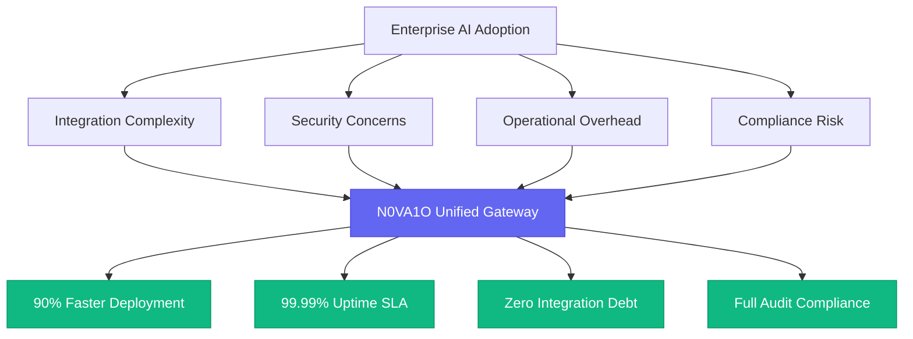

---

## 2. Strategic Architecture

### 2.1 The Unified Gateway Topology

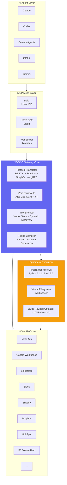

### 2.2 Multi-Transport MCP Architecture

N0VA1O supports three transport modes simultaneously, allowing any AI framework to connect natively:

| Transport | Use Case | Latency | Throughput | Connection Model |
|-----------|----------|---------|------------|------------------|
| **stdio** | Local IDE integration (Cursor, VS Code, Claude Desktop) | <1ms | Medium | Single-process pipe |
| **HTTP SSE** | Cloud/remote agent deployment | <50ms | High | Server-Sent Events |
| **WebSocket** | Real-time streaming, bidirectional | <10ms | Very High | Persistent duplex |

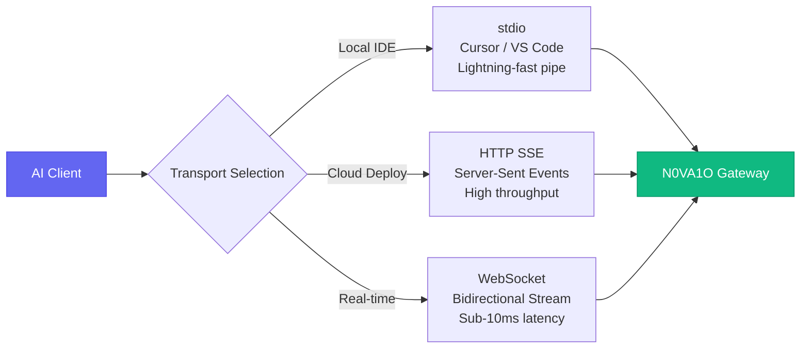

#### 2.2.1 Transport Selection Algorithm

```python
# Pseudocode: Automatic transport selection
class TransportSelector:
    def select_transport(self, context: ConnectionContext) -> Transport:
        if context.environment == "local_ide":
            return stdio.Transport(
                buffer_size=65536,
                heartbeat_interval=30
            )
        elif context.requires_bidirectional:
            return websocket.Transport(
                compression="permessage-deflate",
                max_frame_size=16_777_216  # 16MB
            )
        else:
            return http_sse.Transport(
                keep_alive=True,
                retry_strategy=ExponentialBackoff(
                    base=1.0, max=60.0, multiplier=2.0
                )
            )
```

### 2.3 Protocol Translation Layer

| Source Protocol | Target Protocol | Translation Method | Complexity |
|-----------------|-----------------|-------------------|------------|
| REST (JSON) | SOAP (XML) | Schema mapping + envelope wrapping | Medium |
| REST (JSON) | GraphQL | Query construction + field mapping | Low |
| REST (JSON) | gRPC | Protobuf transcoding + streaming adaptation | High |
| GraphQL | REST | Query decomposition + batch aggregation | Medium |
| gRPC | REST | Unary mapping + server streaming emulation | Medium |
| WebDAV | REST | Method mapping + property translation | Low |
| FTP/SFTP | REST | Command abstraction + session pooling | Medium |
| SOAP | REST | WSDL parsing + XML-to-JSON transformation | High |
| OData | REST | Query option mapping + pagination normalization | Medium |

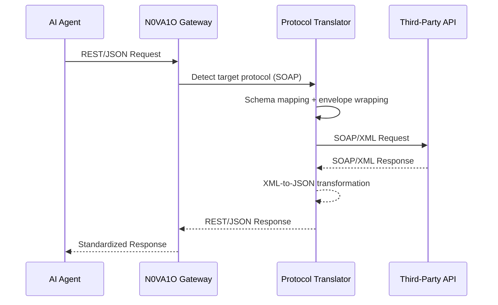

---

## 3. Core Capabilities

### 3.1 Just-In-Time (JIT) Authentication

Dynamic OAuth provisioning based on campaign intent. If Ani detects a workflow requiring Meta CAPI, it provisions scoped permissions on-the-fly using N0VA1O Connect Links.

**Security Guarantee:**
- Model never sees credentials
- Tenant-isolated AES-256-GCM envelope encryption
- Automatic token rotation every 15 days
- Hardware attestation for all auth flows
- Post-quantum key encapsulation (CRYSTALS-Kyber)

```javascript
// JIT Auth Flow
{
  connection_id: "conn_meta_001",
  tenant_id: "tenant_001",
  user_id: "user_001",
  provider: "meta_ads",
  auth_type: "oauth2.1",
  encrypted_tokens: {
    access_token: Buffer,      // AES-256-GCM encrypted
    refresh_token: Buffer,     // AES-256-GCM encrypted
    expires_at: ISODate("..."),
    scopes: ["ads_read", "ads_management", "business_management"]
  },
  allowed_actions: ["read_campaigns", "update_budget", "create_ad"],
  blocked_actions: ["delete_account", "modify_billing"],
  jit_enabled: true,
  provisioned_at: ISODate("2026-07-15T20:42:00Z"),
  auto_refresh: true,
  kyber_public_key: "base64_encoded_kyber768_public_key",
  dilithium_signature: "base64_encoded_dilithium3_signature",
  last_used: ISODate("..."),
  usage_count: 1543,
  health_score: 0.98,
  attestation_report: {
    tpm_quote: "...",
    secure_enclave_cert: "...",
    measured_boot: "sha384:..."
  }
}
```

#### 3.1.1 Token Lifecycle State Machine

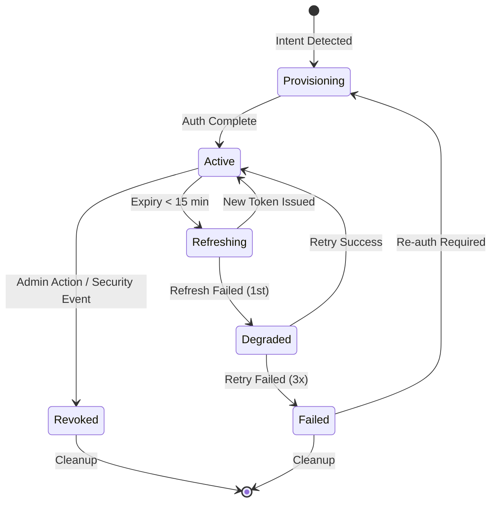

### 3.2 Ephemeral Sandboxes

Isolated MicroVM execution for custom scripts, data processing, and large payload handling.

| Attribute | Standard | Pro | Enterprise |
|-----------|----------|-----|------------|
| Runtime | Python 3.11/3.12 + Bash v5.2 | Same + Node.js 20 | Same + Rust, Go |
| Isolation | Firecracker / gVisor MicroVM | Same + AMD SEV-SNP | Same + Intel TDX |
| CPU Quota | 2 vCPU | 8 vCPU | 32 vCPU |
| RAM Quota | 4GB | 16GB | 128GB |
| Disk Quota | 10GB ephemeral | 100GB ephemeral | 1TB ephemeral |
| Network | Isolated (no egress) | Filtered (allowlist) | Custom VPC peering |
| Timeout | 10 minutes | 60 minutes | 240 minutes |
| GPU Access | -- | -- | NVIDIA A100 / H100 |
| Security | Memory wiped before deallocation | Same + encrypted swap | Same + confidential computing |

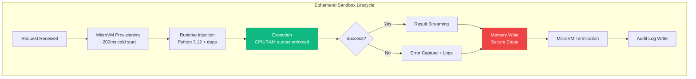

### 3.3 Virtual Filesystem & Large Payload Offloading

When agents interact with large files (>10MB threshold), N0VA1O offloads raw data to the sandbox and returns a lightweight pointer to the LLM.

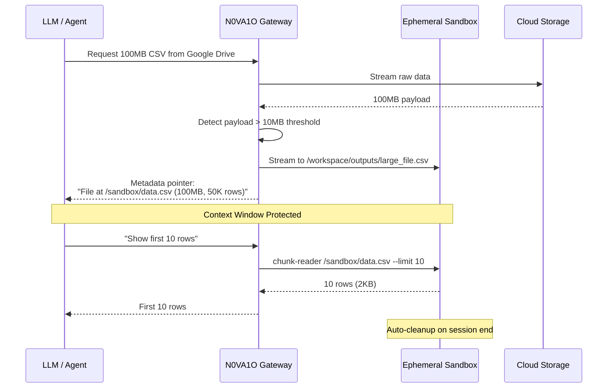

**Benefits:**
- **Context Window Protection:** 100MB files don't crash the LLM
- **Network Isolation:** Raw data never touches the agent host
- **Queryable Offloading:** Agents use file-aware tools (grep, awk, pandas) on sandboxed data
- **Automatic Cleanup:** Ephemeral storage purged after session termination
- **Memory Efficiency:** LLM only receives requested chunks

#### 3.3.1 Supported File Operations

```python
# Sandbox file operation toolkit
class VirtualFileSystem:
    def chunk_read(self, file_pointer: str, offset: int, limit: int) -> DataFrame
    def grep_search(self, file_pointer: str, pattern: str) -> List[Match]
    def awk_process(self, file_pointer: str, script: str) -> str
    def pandas_query(self, file_pointer: str, query: str) -> DataFrame
    def convert_format(self, file_pointer: str, target: str) -> str
    def summarize_stats(self, file_pointer: str) -> Dict[str, Any]
    def stream_export(self, file_pointer: str, destination: str) -> TransferJob
```

### 3.4 Intent-Driven Routing

Vector store + MCP dynamic discovery. If an account has access to 500 actions, only the 3-4 highly relevant tool definitions are injected into the immediate context window.

```http
POST /v1/ai/tools/discover
Authorization: Bearer {tenant_token}
Content-Type: application/json

{
  "query": "I need to find all Q3 invoices in Dropbox, convert to CSV, upload to N0VA Sheets, and notify #finance on Slack",
  "agent_id": "agent_001",
  "max_tools": 5,
  "context_window_size": 128000,
  "preferred_latency": "low",
  "risk_tolerance": "medium"
}

Response:
{
  "intent": "cross_platform_file_workflow",
  "confidence": 0.97,
  "tools": [
    { 
      "name": "dropbox.search_files", 
      "relevance": 0.99, 
      "reason": "Find invoices in Dropbox",
      "estimated_latency_ms": 450,
      "required_scopes": ["files.content.read"],
      "risk_level": "low"
    },
    { 
      "name": "csv_converter.convert", 
      "relevance": 0.95, 
      "reason": "Convert PDFs to CSV",
      "estimated_latency_ms": 2000,
      "required_scopes": ["sandbox.execute"],
      "risk_level": "low"
    },
    { 
      "name": "n0va_sheets.import_csv", 
      "relevance": 0.92, 
      "reason": "Import to N0VA Sheets",
      "estimated_latency_ms": 800,
      "required_scopes": ["sheets.write"],
      "risk_level": "low"
    },
    { 
      "name": "slack.post_message", 
      "relevance": 0.90, 
      "reason": "Notify finance channel",
      "estimated_latency_ms": 300,
      "required_scopes": ["chat:write"],
      "risk_level": "low"
    }
  ],
  "suggested_workflow": "search -> convert -> import -> notify",
  "context_tokens_saved": 12450,
  "total_estimated_latency_ms": 3550
}
```

#### 3.4.1 Intent Classification Pipeline

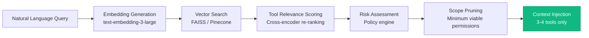

### 3.5 Recipe Compilation

Serializes successful multi-app agent paths into deterministic, type-safe Python Pydantic schemas. Exploratory AI becomes a fixed, high-speed API bypassing LLM inference.

**Exploratory Phase:**
```
Agent: "Find all Q3 invoices in Dropbox, convert to CSV, 
        upload to N0VA Sheets, and notify #finance on Slack"
|
|-> N0VA1O discovers: Dropbox -> CSV Converter -> N0VA Sheets -> Slack
|-> Agent iterates, handles errors, finds optimal path
|-> N0VA1O captures the successful call graph
```

**Compilation Phase:**
```python
# Auto-generated Pydantic schema from successful workflow
from pydantic import BaseModel, Field
from n0va1o.recipes import workflow, WorkflowContext
from typing import Optional, List

class CSVConverterConfig(BaseModel):
    source_format: str = "pdf"
    target_format: str = "csv"
    ocr_enabled: bool = True
    preserve_headers: bool = True

class N0VASheetsWorkbook(BaseModel):
    workbook_id: str
    sheet_name: str = "Q3_Invoices"
    append_mode: bool = False

class Q3InvoiceWorkflow(BaseModel):
    # Auto-compiled recipe from exploratory session sess_abc123
    source: str = Field(default="/Finance/Q3_2026/Invoices", description="Dropbox folder path")
    filter: str = Field(default="*.pdf", description="File filter pattern")
    converter: CSVConverterConfig = Field(default_factory=CSVConverterConfig)
    destination: N0VASheetsWorkbook = Field(default_factory=N0VASheetsWorkbook)
    notification: str = Field(default="#finance", description="Slack channel")
    batch_size: int = 10
    parallel_uploads: bool = True
    error_handling: str = "continue_on_error"

    @workflow(version="1.0.0", compiled_at="2026-07-15T20:42:00Z")
    async def execute(self, ctx: WorkflowContext):
        files = await dropbox.list_files(self.source, self.filter)
        ctx.log(f"Discovered {len(files)} files")
        csv = await csv_converter.batch_convert(files, config=self.converter, sandbox=ctx.sandbox)
        sheet = await n0va_sheets.import_csv(csv, self.destination, deduplicate=True)
        await slack.post(self.notification, f"Q3 invoices imported: {sheet.url} ({sheet.row_count} rows)", priority="low")
        return WorkflowResult(status="success", outputs={"sheet_url": sheet.url, "rows": sheet.row_count})
```

**Production Phase:**
- Compiled recipe bypasses LLM inference entirely
- Executes as high-speed API endpoint
- Maintains N0VA1O auth, sandboxing, and audit trails
- **Latency:** <100ms p99 (vs. 2-5s for LLM-driven execution)
- **Throughput:** 10,000+ executions/minute per recipe

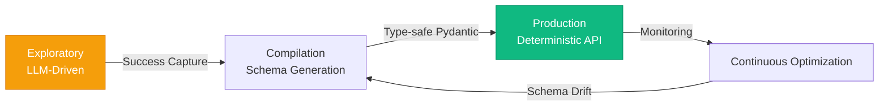

### 3.6 Multi-Account Management

Unlimited platform accounts per tenant. Switch between 50 client Meta Business Managers with one click. Zero re-authentication.

| Feature | Specification |
|---------|--------------|
| Accounts per Tenant | Unlimited |
| Account Switching | One-click, zero re-auth |
| Tenant Isolation | Complete cryptographic separation |
| Token Encryption | Quantum-safe escrow (CRYSTALS-Kyber + Dilithium) |
| Health Monitoring | Real-time connection health per account |
| Auto-Recovery | Automatic reconnection on token expiry |
| Cross-Tenant Access | Impossible by design (hardware-enforced) |
| Account Pooling | Shared credential cache with LRU eviction |

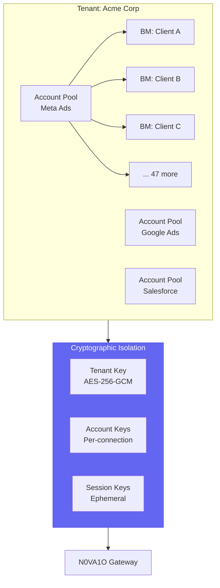

### 3.7 Bidirectional Triggers

Listens to external webhooks (new lead in Salesforce, conversion in Shopify) and immediately prompts the agent to initiate autonomous workflow loops.

| Trigger Source | Event | Agent Action | Latency |
|---------------|-------|--------------|---------|
| Salesforce | New lead created | Create CRM opportunity, assign task, send welcome email | <2s |
| Shopify | Purchase conversion | Update attribution, trigger invoice, notify fulfillment | <1s |
| Slack | @mention in channel | Route to appropriate agent, generate response draft | <500ms |
| Google Calendar | Meeting scheduled | Prepare briefing doc, send agenda, book room | <3s |
| GitHub | Pull request opened | Run CI checks, assign reviewer, update project board | <5s |
| Stripe | Payment failed | Trigger dunning sequence, notify account manager | <1s |
| Zendesk | Ticket escalated | Route to senior agent, pull customer history | <2s |

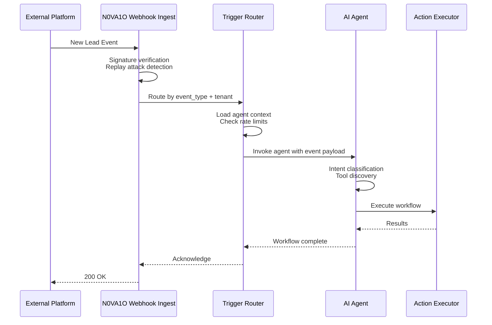


---

## 4. Security & Governance

### 4.1 Zero-Trust Agent Authentication

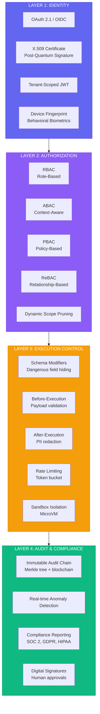

### 4.2 Schema Modifiers

Pre-LLM redaction of dangerous parameters to prevent privilege escalation.

| Modifier Type | Function | Example | Implementation |
|--------------|----------|---------|----------------|
| **Field Redaction** | Hide dangerous fields from agent | `delete_account` field hidden from Ani | JSON Schema stripping before context injection |
| **Value Capping** | Limit numerical parameters | `budget_increase` capped at 50% | Range validation middleware |
| **Action Blocking** | Prevent destructive operations | `delete_campaign` requires explicit admin override | Policy engine intercept |
| **PII Masking** | Redact sensitive data in responses | Customer emails masked as `***@***.com` | Regex + NER pipeline |
| **Scope Filtering** | Limit to approved tool subsets | Finance agents only see accounting tools | RBAC-filtered tool registry |
| **Temporal Gating** | Restrict actions by time | No financial transactions after 6 PM | Time-based policy evaluation |
| **Geographic Fencing** | Restrict by location | Admin actions only from corporate IP ranges | GeoIP + VPN detection |

```python
# Schema modifier implementation
class SchemaModifier:
    def apply(self, schema: dict, agent_context: AgentContext) -> dict:
        # 1. Field redaction
        schema = self._redact_dangerous_fields(schema, agent_context.role)
        # 2. Value capping
        schema = self._cap_numerical_ranges(schema, agent_context.permissions)
        # 3. PII masking in examples
        schema = self._mask_pii_in_examples(schema)
        # 4. Temporal gating
        if not self._is_action_window_open(schema):
            schema = self._block_temporal_actions(schema)
        # 5. Audit logging
        self._log_modification(schema, agent_context)
        return schema
```

### 4.3 Human-in-the-Loop (HITL) Escalation Matrix

| Risk Level | Criteria | Agent Action | Human Role | Timeout |
|------------|----------|--------------|------------|---------|
| **Critical** | Financial transaction >$5K, mass operation >500 items, data deletion, privilege escalation | Block + escalate to interrogation room | Must approve before execution | 4 hours -> auto-reject |
| **High** | External commitment, contract terms, pricing changes, sensitive data sharing | Draft + queue for approval | Review and approve/reject | 24 hours -> auto-reject |
| **Medium** | Internal scheduling, routine responses, standard task creation | Execute + notify | Monitor digest, can override | 72 hours for override |
| **Low** | Auto-label, auto-archive, summary generation, search | Auto-execute + log | Review in periodic audit | N/A |

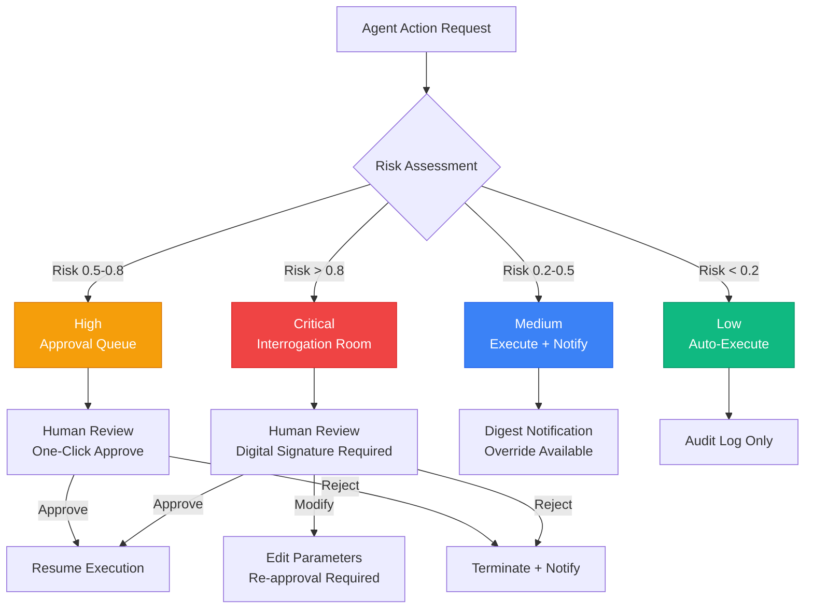

### 4.4 Interrogation Room Protocol

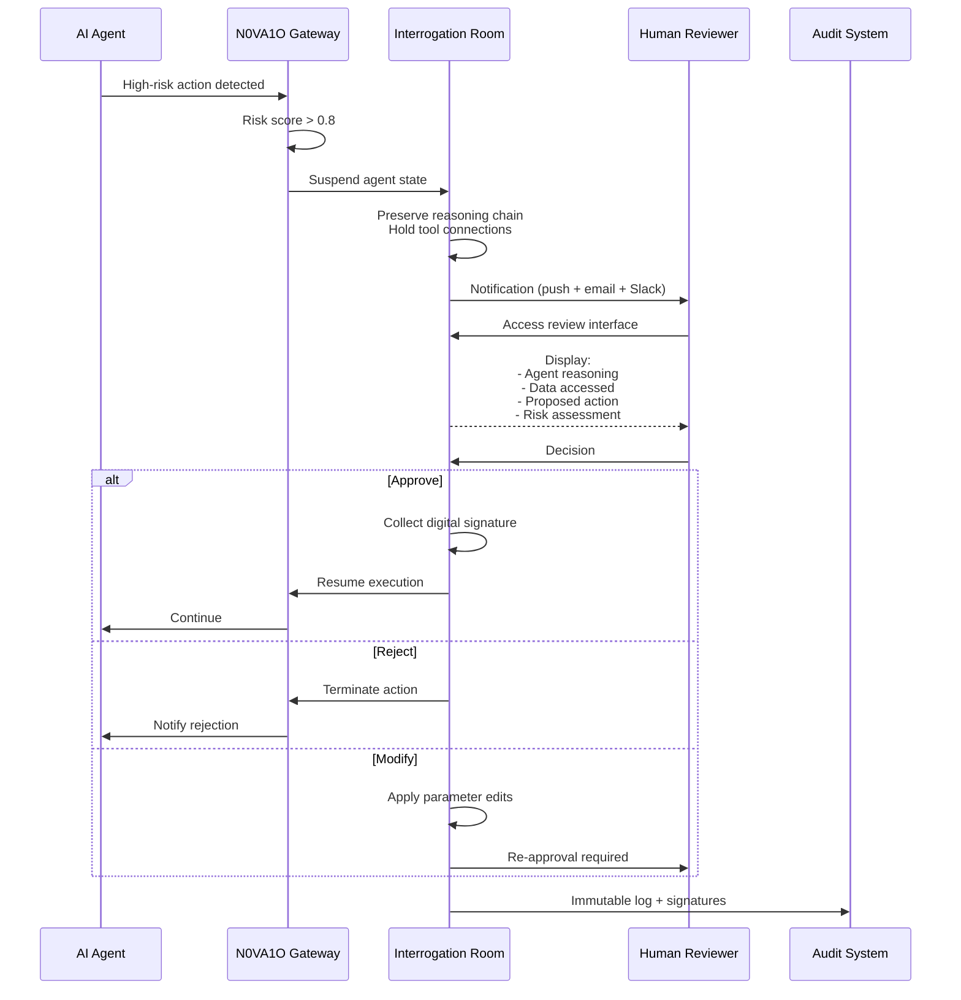

**Interrogation Room Interface:**

| Panel | Contents | Purpose |
|-------|----------|---------|
| **Agent Mind** | Full chain-of-thought, tool calls, reasoning steps | Transparency into AI decision-making |
| **Data Accessed** | All records, files, APIs queried during session | Data lineage verification |
| **Action Preview** | Exact API call with all parameters | Pre-execution validation |
| **Risk Dashboard** | Composite risk score, contributing factors, similar past decisions | Informed decision support |
| **Context Timeline** | Session history leading to this action | Causal chain analysis |
| **Override Controls** | Approve / Reject / Modify / Escalate buttons | Human agency enforcement |

### 4.5 Data Protection

| Data State | Encryption | Technology | Key Management | Rotation |
|-----------|-----------|------------|----------------|----------|
| **Platform API Tokens** | AES-256-GCM + Envelope | Tenant-isolated KMS | JIT provisioning; quantum-safe escrow | 15 days |
| **Attribution Paths in Transit** | TLS 1.3 + Post-Quantum Hybrid | X25519Kyber768 | Perfect forward secrecy | Per session |
| **Attribution Data in Use** | Confidential Computing | AMD SEV-SNP / Intel TDX | Hardware-rooted attestation | N/A |
| **Audience PII in Memory** | Encrypted Memory Enclaves | Automatic scrambling | Memory isolation per tenant | Per process |
| **Long-Term Audit Trails** | CRYSTALS-Kyber/Dilithium | Lattice-based cryptography | QKD integration for Vault | Annual |
| **Backup Archives** | AES-256-GCM + Shamir Secret Sharing | Multi-region HSM | 3-of-5 threshold | 90 days |

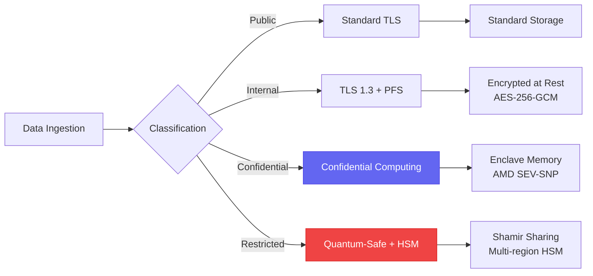


---

## 5. Integration Catalog (1,000+ Platforms)

### 5.1 Marketing & Advertising (100+ integrations)

| Category | Count | Notable Integrations | N0VA1O Capability |
|----------|-------|---------------------|-------------------|
| **Social Advertising** | 25+ | Meta Ads, TikTok Ads, Snapchat Ads, LinkedIn Ads, Twitter/X Ads, Reddit Ads | Auto-provisioning, audience sync, creative upload, real-time bid optimization |
| **Search & Programmatic** | 30+ | Google Ads, Microsoft Ads, Amazon Ads, DV360, The Trade Desk, PubMatic, OpenX | Keyword extraction, automated bidding, placement whitelist management |
| **Creative & Design** | 40+ | Canva, Figma, Adobe CC, Bannerbear, Cloudinary, Remove.bg | Auto-resize, brand kit enforcement, AI-generated variant upload |
| **Analytics & Attribution** | 50+ | Google Analytics 4, Mixpanel, Amplitude, Segment, Snowflake, BigQuery, Triple Whale | Real-time event streaming, multi-touch attribution, incrementality testing |
| **CRM & Sales** | 45+ | Salesforce, HubSpot, Pipedrive, Zoho, Apollo, Attio | Lead scoring sync, opportunity attribution, pipeline velocity tracking |
| **Email & Marketing Automation** | 60+ | Mailchimp, Klaviyo, Iterable, Brevo, ActiveCampaign, Customer.io | Audience list sync, campaign performance feedback loop, automated drip triggers |
| **E-Commerce** | 35+ | Shopify, WooCommerce, BigCommerce, Magento, Stripe | Product catalog sync, dynamic creative optimization, purchase event tracking |
| **Influencer & Affiliate** | 20+ | AspireIQ, Grin, Impact, Tapfiliate, PartnerStack | Creator tracking, commission attribution, UTM governance |
| **Fraud & Brand Safety** | 15+ | DoubleVerify, IAS, Moat, HUMAN, Cheq | IVT monitoring, brand safety scoring, auto-pause on risk threshold |
| **Data Enrichment** | 40+ | Clearbit, ZoomInfo, Apollo, 6sense, Bombora | Audience enrichment, firmographic targeting, intent signal ingestion |

### 5.2 Cloud Storage & Content (100+ integrations)

| Category | Count | Notable Integrations | Sync Direction | Conflict Resolution |
|----------|-------|---------------------|----------------|-------------------|
| **Cloud Storage** | 10+ | S3, Google Drive, Dropbox, Box, OneDrive, Azure Blob, iCloud, pCloud | Bidirectional | Last-write-wins + versioning |
| **Enterprise CMS** | 15+ | SharePoint, Confluence, Notion, Egnyte, Google Workspace | Bidirectional | Merge + manual review |
| **Document Processing** | 30+ | DocuSign, PandaDoc, Docparser, CloudConvert, PDF.co, DocRaptor | Inbound/Outbound | Immutable audit trail |
| **Media Management** | 10+ | Cloudinary, ImageKit, Imgix, Remove.bg, TinyPNG | Bidirectional | CDN invalidation |
| **Development** | 20+ | GitHub, GitLab, Bitbucket | Inbound | Git-native merge |
| **Workflow Automation** | 15+ | Zapier, Make, Celigo, Process Street | Trigger-based | Event sourcing |

### 5.3 Business Operations (200+ integrations)

| Category | Count | Notable Integrations | Key Features |
|----------|-------|---------------------|--------------|
| **Finance & Accounting** | 30+ | QuickBooks, Xero, NetSuite, Sage, Stripe, PayPal | Multi-currency, tax automation, reconciliation |
| **HR & People** | 25+ | Workday, BambooHR, Greenhouse, Lever, Gusto | Onboarding workflows, compliance reporting |
| **Project Management** | 20+ | Jira, Asana, Monday.com, ClickUp, Trello, Notion | Cross-tool dependency mapping |
| **Communication** | 15+ | Slack, Microsoft Teams, Discord, Telegram | Unified inbox, smart routing |
| **Customer Support** | 20+ | Zendesk, Intercom, Freshdesk, ServiceNow, HubSpot Service | Sentiment analysis, auto-escalation |
| **Legal & Compliance** | 10+ | Ironclad, DocuSign CLM, ContractWorks, LegalHold | Clause extraction, risk scoring |
| **Supply Chain** | 15+ | SAP Ariba, Coupa, Oracle Procurement, Freightos | Inventory sync, order tracking |
| **IoT & Hardware** | 25+ | AWS IoT, Azure IoT Hub, Google Cloud IoT, Particle | Real-time telemetry, anomaly detection |

---

## 6. Self-Improving Architecture

N0VA1O's 8-slot modular plugin system continuously optimizes integrations:

| Slot | Plugin Function | Application | Trigger | Impact |
|------|----------------|-------------|---------|--------|
| **1. Auth Optimizer** | Token lifecycle prediction | Proactive refresh before token expiry | Usage pattern analysis | 99.99% auth uptime |
| **2. Schema Drift Detector** | API change detection | Auto-adapt to API v3 -> v4 changes | Nightly diff + webhook alerts | Zero breaking changes |
| **3. Rate Limit Predictor** | Throttling avoidance | Smart batching for API calls | Historical usage + time-series | 40% fewer 429 errors |
| **4. Error Classifier** | Failure pattern learning | Distinguish 429 vs 500 vs auth errors | ML on error logs | 60% faster recovery |
| **5. Payload Compressor** | Data size optimization | Auto-compress large files before upload | File size threshold | 50% bandwidth reduction |
| **6. Route Optimizer** | Path efficiency | Choose fastest CDN edge for access | Latency probing + geolocation | 30% latency improvement |
| **7. Security Hardening** | Vulnerability patching | Auto-block deprecated auth methods | CVE feed + policy engine | Proactive threat mitigation |
| **8. Cost Optimizer** | Spend reduction | Route infrequent access to cold storage | Access pattern analysis | 25% cost reduction |

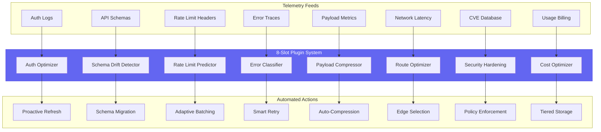

---

## 7. Context-Aware MCP Routing

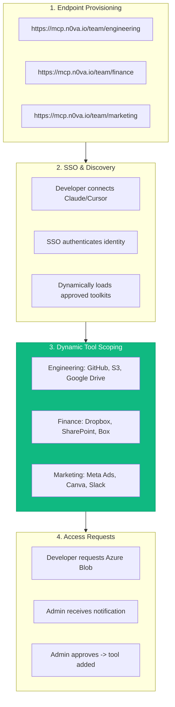

### 7.1 Team-Level Policy Configuration

```yaml
# Example: team-level MCP policy
team: engineering
mcp_endpoint: https://mcp.n0va.io/team/engineering

sso:
  provider: okta
  mfa_required: true
  session_ttl: 8h

tool_whitelist:
  - github.*
  - aws.s3.*
  - google_drive.*
  - slack.post_message

tool_blacklist:
  - github.delete_repository
  - aws.s3.delete_bucket
  - *.*.delete_*

approval_required:
  - github.merge_pull_request
  - aws.s3.put_bucket_policy
  - google_drive.share_externally

rate_limits:
  github: 5000/hour
  aws: 10000/hour
  default: 1000/hour

sandbox:
  enabled: true
  network: filtered
  allowed_domains:
    - github.com
    - *.amazonaws.com
```

---

## 8. Performance & Scalability

### 8.1 Agent Throughput Targets

| Metric | Free Tier | Growth | Pro | Enterprise | Transcendent |
|--------|-----------|--------|-----|------------|-------------|
| Agent executions/day | 100 | 10,000 | 100,000 | Unlimited | Unlimited |
| Concurrent agents | 1 | 10 | 50 | 500 | Unlimited |
| Max workflow steps | 10 | 50 | 100 | 500 | Unlimited |
| Sandbox execution time | 5 min | 10 min | 60 min | 240 min | Unlimited |
| Tool call latency (p99) | <2s | <1s | <500ms | <200ms | <100ms |
| End-to-end workflow | <10s | <5s | <2s | <1s | <500ms |
| Recipe compilation | N/A | N/A | <1 hour | <15 minutes | <5 minutes |
| N0VA1O API calls/day | 100 | 10K | 100K | 1M+ | Unlimited |
| Webhook ingestion/sec | 10 | 100 | 1,000 | 10,000 | 100,000 |
| Multi-account switching | Manual | <5s | <1s | <100ms | Instant |

### 8.2 Scaling Architecture

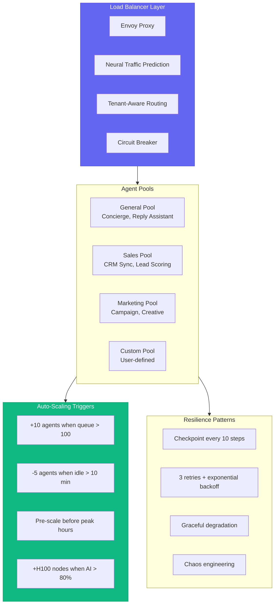

### 8.3 Performance Benchmarks

```
-----------------------------------------------------------------
                    LATENCY BENCHMARKS (p99)
-----------------------------------------------------------------
Tool Discovery         ||||....................  45ms
JIT Auth Provisioning  ||||||||................  120ms
Sandbox Cold Start     ||||||||||||||..........  200ms
Recipe Execution       |||.....................  85ms
LLM-Driven Workflow    ||||||||||||||||||||||  3200ms
Webhook Processing     ||||....................  50ms
Multi-Account Switch   ||......................  15ms
-----------------------------------------------------------------
```


---

## 9. Compliance & Audit

### 9.1 Agent Audit Trail

Every agent action is logged with cryptographic integrity:

```javascript
{
  audit_id: "audit_agent_001_20260711_001",
  timestamp: ISODate("2026-07-11T10:47:00Z"),
  tenant_id: "tenant_001",
  agent_id: "agent_001",
  agent_name: "Mail Concierge",
  agent_version: "1.2.3",
  tool_name: "mail.send_message",
  tool_parameters: {
    to: [{"email": "recipient@example.com"}],
    subject: "RE: Q3 Budget Review",
    body_hash: "sha256:abc123..."
  },
  session_id: "sess_abc123",
  workflow_id: "wf_def456",
  step_number: 7,
  intent_classification: "reply_to_inquiry",
  confidence: 0.94,
  reasoning_chain: [
    "Detected question about budget timeline",
    "Retrieved user calendar for availability",
    "Generated response with proposed meeting time",
    "Compliance check passed (no PII, no unauthorized commitments)"
  ],
  status: "success",
  result_summary: "Message sent, message_id: msg_xyz789",
  latency_ms: 340,
  tokens_consumed: 2450,
  approval_required: false,
  approved_by: null,
  approval_timestamp: null,
  ip_address: "203.0.113.45",
  user_agent: "N0VA1O-Agent/1.2.3",
  mfa_verified: true,
  risk_score: 0.12,
  hash: "sha3-512:...",
  merkle_root: "...",
  blockchain_anchor: "0x...",
  quantum_signature: "dilithium3:..."
}
```

### 9.2 Compliance Mapping

| Regulation | N0VA1O Control | Evidence | Audit Frequency |
|------------|----------------|----------|-----------------|
| **GDPR** | Agent never trains on tenant data | Model isolation audit | Quarterly |
| **GDPR** | Right to erasure automated | Deletion workflow logs | On-demand |
| **HIPAA** | PHI detection + redaction | DLP scan reports | Monthly |
| **HIPAA** | Access logging (who accessed what) | Immutable audit chain | Real-time |
| **SOC 2** | Agent action authorization | RBAC + approval logs | Annual |
| **SOC 2** | Change management for agent updates | Version control + rollback | Per release |
| **FedRAMP** | Air-gapped agent deployment | Deployment manifests | Annual |
| **PCI DSS** | No card data in agent context | Tokenization audit | Quarterly |
| **NIS2** | Incident reporting within 24h | Automated breach detection | Real-time |
| **ISO 27001** | ISMS integration | Control mapping | Annual |

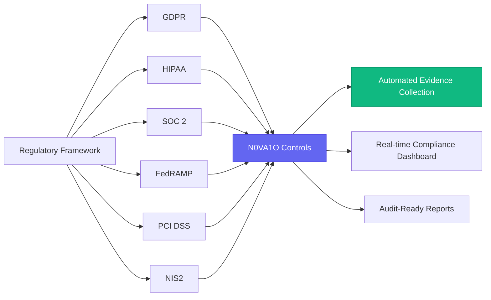

---

## 10. API Specifications

### 10.1 Agent Registration

```http
POST /v1/ai/agents/register
Authorization: Bearer {tenant_token}
Content-Type: application/json

{
  "agent_name": "Cross-Platform Automation Agent",
  "agent_type": "workflow_orchestrator",
  "description": "Autonomous multi-app workflow execution agent",
  "permissions": {
    "n0va1o": ["read", "write", "execute"],
    "storage": ["read", "write"],
    "crm": ["read", "create", "update"],
    "chat": ["read", "post"]
  },
  "autonomy_level": "high",
  "approval_required_for": [
    "n0va1o.delete_resource",
    "crm.update_deal_value",
    "storage.share_externally"
  ],
  "webhook_url": "https://agent.n0va.io/webhooks/agent-001",
  "max_daily_actions": 10000,
  "sandbox_enabled": true,
  "neural_mode": true,
  "context_window": 128000,
  "preferred_model": "claude-3-5-sonnet-20241022",
  "fallback_model": "gpt-4-turbo-preview"
}

Response:
{
  "agent_id": "agent_001",
  "api_key": "n0va_sk_...",
  "status": "active",
  "connected_account": "ca_n0va1o_001",
  "tools_available": ["google_drive.read", "salesforce.create", "slack.post", ...],
  "session_endpoint": "wss://n0va1o.io/sessions/agent_001",
  "sandbox_endpoint": "https://sandbox.n0va1o.io/agent_001",
  "recipe_endpoint": "https://recipes.n0va1o.io/agent_001",
  "created_at": "2026-07-11T10:47:00Z",
  "expires_at": "2027-07-11T10:47:00Z"
}
```

### 10.2 Intent-Based Tool Discovery

```http
POST /v1/ai/tools/discover
Authorization: Bearer {tenant_token}
Content-Type: application/json

{
  "query": "I need to find all Q3 invoices in Dropbox, convert to CSV, upload to N0VA Sheets, and notify #finance on Slack",
  "agent_id": "agent_001",
  "max_tools": 5,
  "context_window_size": 128000,
  "preferred_latency": "low",
  "risk_tolerance": "medium",
  "include_deprecated": false,
  "require_sandbox": false
}

Response:
{
  "intent": "cross_platform_file_workflow",
  "confidence": 0.97,
  "tools": [
    {
      "name": "dropbox.search_files",
      "relevance": 0.99,
      "reason": "Required to find invoices matching criteria",
      "estimated_latency_ms": 450,
      "required_scopes": ["files.content.read"],
      "risk_level": "low",
      "deprecated": false
    }
  ],
  "suggested_workflow": "search -> convert -> import -> notify",
  "context_tokens_saved": 12450,
  "total_estimated_latency_ms": 3550,
  "fallback_tools": ["google_drive.search", "box.search"]
}
```

### 10.3 Recipe Compilation

```http
POST /v1/ai/recipes/compile
Authorization: Bearer {tenant_token}
Content-Type: application/json

{
  "session_id": "sess_abc123",
  "recipe_name": "Monthly_Finance_Report_Sync",
  "description": "Auto-sync QBO invoices to N0VA Sheets and notify Slack",
  "schedule": {
    "type": "cron",
    "expression": "0 9 1 * *",
    "timezone": "America/New_York"
  },
  "optimization_level": "aggressive",
  "failover_enabled": true,
  "notification_channels": ["slack", "email"]
}

Response:
{
  "recipe_id": "rec_001",
  "compiled_schema": "pydantic_v2",
  "execution_endpoint": "https://n0va1o.io/recipes/rec_001/execute",
  "estimated_latency_ms": 85,
  "requires_approval": false,
  "risk_score": 0.12,
  "version": "1.0.0",
  "compiled_at": "2026-07-15T20:42:00Z",
  "next_scheduled_run": "2026-08-01T09:00:00-04:00",
  "monitoring_dashboard": "https://n0va1o.io/dashboard/recipes/rec_001"
}
```

### 10.4 Session Management

```http
POST /v1/ai/sessions/create
Authorization: Bearer {agent_api_key}
Content-Type: application/json

{
  "agent_id": "agent_001",
  "context": {
    "user_id": "user_001",
    "tenant_id": "tenant_001",
    "session_type": "interactive"
  },
  "tools": ["dropbox.search_files", "slack.post_message"],
  "sandbox_config": {
    "cpu_quota": 2,
    "ram_quota": 4096,
    "timeout_seconds": 600,
    "network_mode": "filtered"
  }
}

Response:
{
  "session_id": "sess_abc123",
  "websocket_url": "wss://n0va1o.io/sessions/sess_abc123",
  "sandbox_url": "https://sandbox.n0va1o.io/sessions/sess_abc123",
  "expires_at": "2026-07-11T11:47:00Z",
  "tools_injected": 4,
  "context_tokens_used": 2450,
  "context_tokens_remaining": 125550
}
```

### 10.5 Webhook Events

| Event | Payload | Trigger | Retry |
|-------|---------|---------|-------|
| `n0va1o.connection_established` | Connection metadata | New platform connected | No |
| `n0va1o.connection_failed` | Error details + retry count | Auth failure or API error | Exponential |
| `n0va1o.recipe_executed` | Recipe ID + result + latency | Compiled recipe run | No |
| `n0va1o.agent_action_completed` | Action details + outcome | Agent tool call | No |
| `n0va1o.approval_required` | Action details + risk score | HITL escalation | Manual |
| `n0va1o.schema_drift_detected` | Provider + field changes | API version change | No |
| `n0va1o.rate_limit_approaching` | Provider + remaining quota | 80% of quota consumed | No |
| `n0va1o.sandbox_execution_complete` | Output + logs + metrics | Sandbox task finish | No |
| `n0va1o.token_rotated` | Connection ID + rotation time | Automatic token refresh | No |
| `n0va1o.security_alert` | Alert type + severity + evidence | Anomaly detection | No |


---

## 11. SDK Reference

### 11.1 Python SDK

```python
# Installation: pip install n0va1o

import asyncio
from n0va1o import N0VA1OClient, AgentConfig, SandboxConfig

async def main():
    # Initialize client
    client = N0VA1OClient(
        api_key="n0va_sk_...",
        tenant_id="tenant_001",
        endpoint="https://n0va1o.io",
        transport="websocket"  # stdio | http_sse | websocket
    )

    # Register agent
    agent = await client.agents.register(
        AgentConfig(
            name="Finance Automation Agent",
            type="workflow_orchestrator",
            permissions=["storage.read", "sheets.write", "slack.post"],
            autonomy_level="high",
            sandbox_enabled=True
        )
    )

    # Discover tools by intent
    tools = await client.tools.discover(
        query="Find Q3 invoices and upload to sheets",
        max_tools=5
    )
    print(f"Discovered {len(tools)} tools")

    # Create sandboxed session
    session = await client.sessions.create(
        agent_id=agent.id,
        sandbox_config=SandboxConfig(
            cpu=2, ram=4096, timeout=600,
            network_mode="filtered"
        )
    )

    # Execute workflow
    result = await session.execute("Find Q3 invoices, convert to CSV, upload to sheets, notify Slack")

    # Compile to recipe
    recipe = await client.recipes.compile(
        session_id=session.id,
        name="Q3_Invoice_Sync",
        schedule="0 9 1 * *"
    )

    # Execute compiled recipe (bypasses LLM)
    recipe_result = await recipe.execute()
    print(f"Recipe executed in {recipe_result.latency_ms}ms")

    await session.close()
    await client.close()

if __name__ == "__main__":
    asyncio.run(main())
```

### 11.2 JavaScript/TypeScript SDK

```typescript
// Installation: npm install @n0va1o/sdk

import { N0VA1OClient, AgentConfig } from '@n0va1o/sdk';

async function main() {
  const client = new N0VA1OClient({
    apiKey: 'n0va_sk_...',
    tenantId: 'tenant_001',
    endpoint: 'https://n0va1o.io',
    transport: 'websocket'
  });

  const agent = await client.agents.register({
    name: 'Marketing Campaign Agent',
    type: 'campaign_orchestrator',
    permissions: ['meta_ads.read', 'meta_ads.write', 'slack.post'],
    autonomyLevel: 'medium',
    approvalRequiredFor: ['meta_ads.update_budget']
  });

  const session = await client.sessions.create({
    agentId: agent.id,
    onMessage: (msg) => console.log('Agent:', msg),
    onError: (err) => console.error('Error:', err),
    onApprovalRequired: (action) => showApprovalDialog(action)
  });

  await client.close();
}
```

### 11.3 Go SDK

```go
// Installation: go get github.com/n0va1o/sdk-go

package main

import (
    "context"
    "fmt"
    "log"
    "time"
    n0va1o "github.com/n0va1o/sdk-go"
)

func main() {
    ctx := context.Background()

    client, err := n0va1o.NewClient(n0va1o.Config{
        APIKey:    "n0va_sk_...",
        TenantID:  "tenant_001",
        Endpoint:  "https://n0va1o.io",
        Transport: n0va1o.TransportHTTP,
        Timeout:   30 * time.Second,
    })
    if err != nil { log.Fatal(err) }
    defer client.Close()

    agent, err := client.Agents.Register(ctx, n0va1o.AgentConfig{
        Name:            "DevOps Automation",
        Type:            "infrastructure_orchestrator",
        Permissions:     []string{"github.read", "aws.ec2.manage"},
        AutonomyLevel:   n0va1o.AutonomyHigh,
        SandboxEnabled:  true,
        MaxDailyActions: 50000,
    })
    if err != nil { log.Fatal(err) }

    session, err := client.Sessions.Create(ctx, n0va1o.SessionConfig{
        AgentID: agent.ID,
        Sandbox: &n0va1o.SandboxConfig{
            CPU:          4,
            RAM:          8192,
            Timeout:      1200,
            NetworkMode:  n0va1o.NetworkFiltered,
            AllowedHosts: []string{"github.com"},
        },
    })
    if err != nil { log.Fatal(err) }
    defer session.Close()

    result, err := session.Execute(ctx, "List open PRs and run CI checks")
    if err != nil { log.Fatal(err) }

    fmt.Printf("Completed: %s (%dms)\n", result.Status, result.LatencyMs)
}
```

### 11.4 CLI Reference

```bash
# Installation
curl -sSL https://n0va1o.io/install | bash

# Authenticate
n0va1o auth login --tenant tenant_001 --method sso

# Register agent
n0va1o agents create \
  --name "Finance Agent" \
  --type workflow_orchestrator \
  --permissions "storage.read,sheets.write,slack.post" \
  --autonomy high \
  --sandbox

# Discover tools
n0va1o tools discover \
  --agent agent_001 \
  --query "Find invoices and upload to sheets" \
  --max-tools 5

# Start interactive session
n0va1o sessions start \
  --agent agent_001 \
  --transport websocket \
  --sandbox-cpu 2 \
  --sandbox-ram 4096

# Compile recipe from session
n0va1o recipes compile \
  --session sess_abc123 \
  --name "Monthly_Invoice_Sync" \
  --schedule "0 9 1 * *" \
  --watch

# Execute recipe
n0va1o recipes execute rec_001 --params '{"month": "2026-07"}'

# Monitor
n0va1o monitor --agent agent_001 --follow
n0va1o logs --session sess_abc123 --tail 100

# Security audit
n0va1o audit trail --agent agent_001 --since 2026-07-01
n0va1o security scan --agent agent_001
```


## 13. Glossary

| Term | Definition |
|------|------------|
| **N0VA1O** | N0VA's unified integration gateway enabling AI agents to securely connect to 1,000+ third-party applications |
| **MCP** | Model Context Protocol — standardized protocol for AI tool communication |
| **JIT Auth** | Just-In-Time Authentication — dynamic OAuth provisioning based on intent |
| **HITL** | Human-in-the-Loop — real-time human oversight for high-stakes AI decisions |
| **Recipe Compilation** | N0VA1O feature that converts exploratory AI workflows into deterministic, reusable APIs |
| **BYOC** | Bring Your Own Cloud — N0VA1O deployment option keeping all data in customer VPC |
| **Fluid Workspace** | N0VA concept where work context follows users across modules, devices, and sessions |
| **Hyper-Context** | Shared layer linking all related data across N0VA modules |
| **Temporal Snapshots** | N0VA feature allowing "time travel" to any previous workspace state |
| **Atomic Actions** | Cross-module operations that succeed or rollback as a single transaction |
| **Penta-Audience** | N0VA's five-interface philosophy: External, Internal, Autonomous, Neural, Ambient |
| **Schema Modifier** | Pre-LLM redaction of dangerous parameters to prevent privilege escalation |
| **Dynamic Scope Pruning** | Stripping OAuth scopes to minimum needed for specific intent |
| **Sandbox** | Isolated MicroVM execution environment for agent code |
| **Virtual Filesystem** | Large payload offloading system protecting LLM context windows |

---

## 14. Appendix: Integration Quick Reference

### 14.1 Supported Authentication Methods

| Method | Platforms | Security Level |
|--------|-----------|---------------|
| OAuth 2.1 | Google, Microsoft, Meta, Salesforce | High |
| OAuth 2.0 (legacy) | Twitter/X, LinkedIn, Dropbox | Medium |
| OAuth 1.0a | Twitter legacy, Trello | Medium |
| SAML 2.0 | Enterprise IdPs (Okta, Azure AD) | High |
| OIDC | Standard identity providers | High |
| JWT | Custom APIs, internal services | High |
| API Key | Stripe, SendGrid, Twilio | Medium |
| Basic Auth | Legacy systems, FTP | Low (with TLS) |
| AWS Signature V4 | S3, AWS services | High |
| Azure SAS | Azure Blob, Azure services | High |
| Custom Header | Proprietary APIs | Configurable |


---

**N0VA1O** represents the convergence of sovereign integration and autonomous intelligence. Every connection is no longer just an API call — it is an event in a living workflow, processed by agents that learn, adapt, and act on behalf of the organization while maintaining absolute security, compliance, and human oversight.

---

N0VA1O for single approach infinite integration
Traditional AI agents hit a wall when attempting to interact with software due to API friction, complex OAuth flows, and fragile execution layers. N0VA1O collapses this $N \times M$ integration problem down to 1. By establishing a unified gateway, it enables framework-agnostic AI agents to securely connect to, read from, and write to over 1,000+ third-party software applications in production environments.  
Advanced & Enhanced Features
 Just-In-Time & Managed Authentication
End-to-End OAuth Handling: Eliminates the need for developers to write boilerplate authentication flows. N0VA1O manages token lifecycles, proactive rotations, and dynamic refreshes natively
Inline / Intended Auth: Triggered dynamically based on end-user intent. If an agent detects a workflow requiring a GitHub PR, it provisions scoped permissions on the fly using N0VA1O Connect Links.
Granular Scoping: Supports strict Role-Based Access Control (RBAC) and least-privilege scoping to ensure an agent only accesses what is explicitly authorized.
Programmatic Execution & Dynamic Sandboxing
Ephemeral Remote Sandboxes: Rather than risking local execution, tool calls and complex operations (such as running bash scripts or bulk data processing using Python code) are safely contained within a secure, isolated remote sandbox environment.
Navigable Remote Filesystems: When an agent handles massive datasets or outputs too large for an LLM's context window, N0VA1O stores them in a remote filesystem. The agent can natively browse, search, and parse these files using directory navigation.
Intent-Driven Tool Routing & "Smart Tools"
Resolution by Intent: Developers don't need to manually map every tool configuration. N0VA1O optimizes tool discovery by intent, presenting only the necessary tools to the agent at the exact moment they are required.
Account-Level Optimization: N0VA1O applies machine learning models to analyze failure/success rates over millions of real-world tool calls. The framework dynamically tunes tool descriptions and parameters to minimize agent invocation errors over time.
Bidirectional Triggers & Context-Aware Sessions
Persistent State Management: Real-world workflows are rarely single-step. N0VA1O tracks multi-step workflows via specialized Session objects, preserving historical tool execution logs so agents can iterate on complex logic.
Real-Time Listening: Supports bidirectional triggers. The platform can listen to external webhooks (e.g., a new lead in Salesforce or an issue in Sentry) and immediately prompt the agent to initiate an autonomous workflow loop.
The Self-Improving Architecture
  features an autonomous self-improving runtime loop designed to let agents manage their own deployment and debugging pipelines. This is optimized through an 8-slot modular plugin system:

Automated Regression Fixing (Reactions Architecture): When a code-generation agent pushes a branch and triggers a Continuous Integration (CI) failure or receives review comments, the orchestrator automatically re-spawns an agent inside that specific workspace session, feeding the raw error traces directly back into the LLM context.

Token-Activity Telemetry: Instead of relying on agents to self-report their state (which often introduces hallucinations or confusion), the orchestrator monitors execution logs directly at the process level. It dynamically tracks whether the model is actively generating tokens, waiting for external tool completion, or sitting idle.

Workspace Isolation via TMUX/Worktrees: The orchestrator spins up ephemeral git worktrees paired with active TMUX sessions, allowing engineers to connect via terminal (iTerm2) or a web dashboard to watch agents execute bash code, resolve package conflicts, and run tests in real time.

Advanced Context Hygiene & The 6-Step Agent Loop
Feeding dozens of full API schemas directly into a system prompt spikes token costs and degrades tool-selection accuracy. N0VA1O addresses this by upgrading the classic agent loop to a specialized Dynamic Discovery Loop:

[User Prompt] ➔ [Step 0: Intent-Based Tool Registry Search] ➔ [Step 1: Inject Minimal Tool Definitions] ➔ [Step 2: LLM Tool Call Prediction] ➔ [Step 3: Secure Execution Layer (Auth/Sandbox)] ➔ [Step 4: Response Schema Transformation] ➔ [Final Output]
Step 0 Tool Discovery: Before tool definitions hit the LLM, the input is parsed via a dynamic tool registry (leveraging Vector stores and the Model Context Protocol). If an account has access to 500 actions, only the 3 or 4 highly relevant tool definitions are injected into the immediate context window.

Semantic Compression: Raw JSON schemas are aggressively condensed to remove text boilerplate while preserving strict parameter types, ensuring a complex integration (like Salesforce or Jira) consumes minimum context.

 The Tool Interception & Payload Modifier Layer
N0VA1O gives developers precise, granular control over what data goes into the model and what leaves the runtime environment through three distinct execution lifecycle modifiers:

Schema Modifiers
Executed before the tool definition is exposed to the LLM. It allows programmatic stripping or renaming of parameters. If you want to prevent an agent from ever seeing or using a delete_user field within an admin toolkit, the schema modifier redacts it entirely from the model's sight.

Before-Execution Modifiers
Interceptors that catch the model's generated JSON payload after prediction but before hitting the third-party API. This allows developers to hardcode corporate guardrails, inject hidden tokens, or run validation steps .

After-Execution Modifiers
Executed after the third-party API responds but before returning the string back to the LLM.

Data Truncation Mitigation: If a database query returns a  80MB CSV file, an unmanaged agent will crash or overflow the context window. An After-Execution Modifier automatically catches this payload, saves it directly to a secure, navigable remote filesystem sandbox, and returns a lightweight file pointer  along with a summary to the agent.

Human-in-the-Loop (HITL) & Escalation Environments
For regulated, high-stakes enterprise workflows (such as financial transactions, legal analysis, or infrastructure deployments), N0VA1O provides real-time state machine suspension mechanisms.

Interrogation Rooms: If a risk mitigation tool flags an active transaction (e.g., a potential compliance collision or an unverified security deployment), the underlying state machine (such as LangGraph or CrewAI) shifts into a paused state.

Live Interactive Debugging: Instead of throwing a generic error, the platform holds the session open. A human compliance or DevOps officer can drop directly into the running session, view the agent's complete scratchpad and internal thoughts, run manual interrogations on the agent's open tools, and provide a secure digital signature to either release or terminate the process.
To understand the deep infrastructure of N0VA1O as a mission-critical runtime for AI agents, we must examine its bare-metal orchestration, protocol handling, cryptographic boundaries, and state management systems.N0VA1O is engineered to transform non-deterministic LLMs into deterministic, production-grade enterprise software execution engines.1. Ephemeral Sandbox Orchestration & Micro-Runtime SpecificationsComposio abstracts compute through isolated, on-demand code execution sandboxes. These are designed to safely process arbitrary file interactions and code executions generated by an AI model.


THE INFINITE INTEGRATION GATEWAY
9.1 The N×M → 1 Problem Collapse
Traditional AI agents face:
API Friction: 1,000+ different authentication patterns
OAuth Complexity: Complex flows, token rotation, scope management
Fragile Execution: Schema drift, rate limits, malformed payloads
N0VA1O collapses this to ONE unified gateway:
plain
┌─────────────────────────────────────────────────────────────────────────────┐
│                         N0VA1O INTEGRATION GATEWAY                           │
│                    "One Gateway. Infinite Possibilities."                    │
├─────────────────────────────────────────────────────────────────────────────┤
│                                                                             │
│   ┌─────────────┐     ┌─────────────────────────────────────────────────┐  │
│   │  AI AGENTS  │────▶│         UNIFIED MODEL CONTEXT PROTOCOL          │  │
│   │  (Any Framework)│  │              (MCP) MESH LAYER                    │  │
│   └─────────────┘     │  ┌─────────┐  ┌─────────┐  ┌─────────┐        │  │
│                       │  │  stdio  │  │  HTTP   │  │  SSE    │        │  │
│   ┌─────────────┐     │  │ (Local) │  │ (Cloud) │  │(Stream) │        │  │
│   │   CLAUDE    │────▶│  └────┬────┘  └────┬────┘  └────┬────┘        │  │
│   └─────────────┘     │       └─────────────┼─────────────┘             │  │
│   ┌─────────────┐     │                     ▼                           │  │
│   │   CODEX     │────▶│         ┌─────────────────────┐                 │  │
│   └─────────────┘     │         │  PROTOCOL TRANSLATOR │                 │  │
│   ┌─────────────┐     │         │  REST ↔ SOAP ↔ GraphQL ↔ gRPC        │  │
│   │  CUSTOM     │────▶│         └─────────────────────┘                 │  │
│   └─────────────┘     │                     ▼                           │  │
│                       │         ┌─────────────────────┐                 │  │
│                       │         │   ZERO-TRUST AUTH    │                 │  │
│                       │         │  AES-256-GCM Envelope│                 │  │
│                       │         │  JIT Authentication  │                 │  │
│                       │         │  Dynamic Scope Prune │                 │  │
│                       │         └─────────────────────┘                 │  │
│                       │                     ▼                           │  │
│                       │   ┌─────────────────────────────────────────┐   │  │
│                       │   │      1,000+ THIRD-PARTY INTEGRATIONS     │   │  │
│                       │   │  ┌────────┐ ┌────────┐ ┌────────┐      │   │  │
│                       │   │  │Salesforce│ │HubSpot │ │Stripe  │      │   │  │
│                       │   │  │GitHub   │ │Slack   │ │Jira    │      │   │  │
│                       │   │  │Zapier   │ │Notion  │ │Airtable│      │   │  │
│                       │   │  │...      │ │...     │ │...     │      │   │  │
│                       │   │  └────────┘ └────────┘ └────────┘      │   │  │
│                       │   └─────────────────────────────────────────┘   │  │
│                       └─────────────────────────────────────────────────┘  │
│                                                                             │
└─────────────────────────────────────────────────────────────────────────────┘
9.2 N0VA1O Advanced Capabilities
Table
Capability	Specification	Security Guarantee
Just-In-Time Auth	Dynamic OAuth provisioning based on intent, scoped permissions on-the-fly	Model never sees credentials
Ephemeral Sandboxes	Isolated MicroVM execution, Python 3.11/3.12 + Bash v5.2, CPU/RAM quotas	Network isolation from host
Virtual Filesystem	Large payload offloading (>threshold → sandbox storage, file pointer returned)	Context window protection
Intent-Driven Routing	Vector store + MCP dynamic discovery, only 3-4 relevant tools injected	Minimal attack surface
Schema Modifiers	Pre-LLM redaction of dangerous parameters (e.g., delete_user hidden)	Privilege escalation impossible
Before-Execution	Payload interception for corporate guardrails, hidden token injection	Compliance enforcement
After-Execution	Auto-truncation, summarization, filesystem offloading for large responses	Context overflow prevention
Human-in-the-Loop	Real-time state machine suspension, interrogation rooms, digital signature release	Regulatory compliance
9.3 Integration Catalog (Partial — 1,000+ Total)
Table
Category	Count	Notable Integrations
CRM	50+	Salesforce, HubSpot, Pipedrive, Zoho, Dynamics, Apollo
ERP	30+	SAP, NetSuite, Odoo, Sage, Workday, Epicor
DevOps	100+	GitHub, GitLab, Jira, Confluence, Azure DevOps, Linear
Communication	80+	Slack, Teams, Discord, Telegram, WhatsApp, Zoom
Finance	60+	Stripe, PayPal, QuickBooks, Xero, Plaid, Ramp
Marketing	120+	Mailchimp, HubSpot Marketing, Klaviyo, ActiveCampaign
Analytics	70+	Google Analytics, Mixpanel, Amplitude, Snowflake, BigQuery
AI/ML	50+	OpenAI, Anthropic, Hugging Face, Pinecone, Replicate
Storage	40+	S3, Google Drive, Dropbox, Box, Azure Blob, OneDrive
E-Commerce	40+	Shopify, WooCommerce, BigCommerce, Square, Gumroad
HR	30+	BambooHR, Workday, Greenhouse, Lever, Gusto
Legal	20+	Clio, DocuSign, PandaDoc, iManage, NetDocuments
Health	25+	Epic, Cerner, Athenahealth, Apple HealthKit, Google Fit
IoT	40+	AWS IoT, Azure IoT Hub, MQTT, OPC-UA, Modbus, Zigbee
Social	50+	LinkedIn, Twitter/X, Facebook, Instagram, TikTok, YouTube


+-----------------------------------------------------------------+
|                        N0VA1O RUNTIME                         |
|                                                                 |
|  [LLM / Agent Framework] --(Resource Pointer)--> [Virtual FS]  |
|          |                                            ^         |
|     (Executes)                                     (Syncs)      |
|          v                                            |         |
|  [Isolated MicroVM / Micro-Container Sandbox] --------+         |
|   -> Python 3.11 Runtime (Data Analytics Stack)                 |
|   -> Secure Shell (Bash v5.2, Locked Networking)                |
+-----------------------------------------------------------------+
Compute IsolationEvery programmatic task (such as running a script or modifying a repository) triggers an ephemeral MicroVM or micro-container. Runtimes are isolated from the host system, operating with strict CPU and memory resource quotas to prevent denial-of-service loops caused by malfunctioning agent logic.Virtual Filesystem & Large Payload OffloadingTo protect the LLM context window from being flooded by large data streams (e.g., a 100MB database export or a thousand-line logs file), the platform implements an isolated filesystem pointer pattern:When a tool produces an output exceeding structural thresholds, the payload is written directly to the sandbox's volatile storage block (/workspace/outputs/).The orchestrator intercepts the return pipeline and swaps the raw payload out for an enriched metadata reference string containing a file path token and structural summary metrics.The agent can then use downstream file-aware tools (e.g., chunked file readers or grep utilities) to navigate the filesystem as needed.Pre-Baked Runtime EnvironmentsSandboxes are provisioned with optimized execution layers, including Python 3.11/3.12 pre-configured with analytical dependencies (pandas, numpy, scikit-learn, matplotlib) alongside basic Unix CLI tools. Networking can be programmatically set to either a strict internal loop or internet-enabled, depending on security clearance profiles.2. Model Context Protocol (MCP) Mesh & Multi-Transport ArchitectureComposio acts as an enterprise-wide tool routing gateway by establishing a multi-protocol translation plane between agents and upstream services.Unified Protocol Translation: N0VA1O converts older upstream interfaces (REST, SOAP, GraphQL, gRPC) into standardized Model Context Protocol (MCP) payloads. This allows clients like Claude Code, Cursor, and custom enterprise agent frameworks to communicate with over 1,000 external applications through a single protocol.Dual-Transport Streaming Engine:Local Invocations: Communicates over native standard I/O (stdio) pipes for lightning-fast execution inside local IDE extensions or terminal CLI utilities.Remote/Cloud Orchestration: Leverages high-throughput HTTP Server-Sent Events (SSE) streaming paths, enabling remote microservices to maintain persistent, low-overhead links with the N0VA1O tool plane.Graph-Based Action Resolution: The tool selection matrix resolves tool dependencies via a structural graph layout. If an agent calls a high-level action, the router automatically calculates, verifies, and maps parent configurations and parameters required for successful execution.3. Cryptographic Token Lifecycle & Least-Privilege AuthorizationManaging user credentials across thousands of endpoints without exposing raw tokens to non-deterministic agents requires a Zero-Trust approach to authentication.Token Encryption TopologyEnd-user authentication materials (OAuth refresh tokens, static API authorization tokens, SSH identities) are protected using multi-tenant envelope encryption:Data is encrypted at rest using AES-256-GCM.Every distinct user_id session utilizes a uniquely generated Data Encryption Key (DEK).DEKs are encrypted using master Key Encryption Keys (KEKs) housed within dedicated hardware security modules (HSMs) via cloud-native KMS providers or HashiCorp Vault instances. Raw credentials are never held in application layer memory blocks.Just-In-Time (JIT) Authentication & Intercept LoopsIf an agent initiates an action against an integration that has not yet been linked—or whose authorization token has expired—Composio blocks the pipeline execution and returns a structured hook response:1.Token State Interception:Sub-millisecond Check.The Tool Router intercepts the agent's tool execution attempt and detects a missing or invalid authentication token.2.Transient Auth Link Generation:Single-Use, Time-Bound Token.The platform halts execution and generates a highly localized, short-lived authentication redirect URL (Auth Link).3.Identity Provider Verification:User Interactivity Loop.The end-user clicks the secure link to log into the third-party application provider (e.g., Salesforce, Google Admin Server) via OAuth.4.Callback Capture & Execution Resume:Secure State Restoration.N0VA1O captures the secure callback, saves the encrypted tokens, clears the blocked state, and securely passes execution control back to the active agent session.Dynamic Scope PruningDevelopers can enforce runtime role policies that strip unsafe API scopes out of the OAuth lifecycle prior to presentation to the agent. This ensures that even if an agent hallucinates a payload, it cannot execute administrative overrides like DELETE /org/settings.4. Architectural Resource Addressing & State ControlComposio's SDK v3 architecture uses tightly scoped, typed resource states to minimize operational vulnerabilities in high-velocity multi-agent environments.Resource Addressing MatrixResource TypeIdentifier PrefixStructural Engineering PurposeConnected Accountca_Represents an authenticated instance of an external toolkit tied to an explicit user identity.Authorization Configac_Defines developer-level application settings, API client IDs, and required global access scopes.Active Sessionsess_Isolates an agentic execution window, binding all subsequent tool queries to a single context thread.Automation Triggertr_Defines incoming webhook configurations mapping real-time app events to agent actions.Security Advantage of Prefixed Resource Identifiers: Standard 36-character UUIDs are prone to ingestion validation failures. Using Resource Nano IDs (e.g., ca_8x9w2l3k5m) prevents type-jacking and database injection vulnerabilities. It allows low-cost string parsing at the gateway layer before routing payloads to underlying database engines.Workflow-to-Recipe CompilationComposio features an automated code serialization engine. When an exploratory agent identifies an unmapped multi-step resolution path across various apps (e.g., scanning Jira, checking a GitHub commit, and alerting Slack), the platform captures the underlying call graph sequence.It compiles this sequence into a fully deterministic, static Python Pydantic schema / TypeScript interface recipe. This allows developers to turn experimental agent workflows into hardcoded, high-performance API endpoints that bypass the need for LLM inference on subsequent runs.

Intent-Based Dynamic Resolution: Integrates with the Model Context Protocol (MCP) to resolve and inject only the exact 3–4 required tool schemas dynamically at runtime based on real-time intent.
Zero-Trust Auth Gateway: End-to-end managed OAuth and API key injection using tenant-isolated AES-256-GCM envelope encryption via KMS. The model never sees a credential.
Workflow-to-Recipe Compiler: Serializes successful multi-app agent paths into deterministic, type-safe Python Pydantic schemas. Exploratory AI becomes a fixed, high-speed API.
Virtual Filesystem Offloading: Intercepts massive payloads, dumps them into an ephemeral MicroVM sandbox, and hands the agent a lightweight file pointer (e.g., /sandbox/data.csv).
N0VA1O doesn't just pass text; it orchestrates live compute. It provisions on-demand, isolated code-execution sandboxes running locked-down Python 3.11/3.12 data stacks or secure Bash v5.2 environments. Agents can write, test, debug, and run their own code in real time with hardware-enforced CPU/RAM quotas, completely isolated from your core network infrastructure.
Multi-Transport MCP Routing Mesh
Built natively for modern AI ecosystems, Composio bridges legacy protocols (SOAP, REST, GraphQL, gRPC) directly into the Model Context Protocol (MCP).

Local Speed: Blazing-fast stdio pipe streaming for IDE integrations (Cursor, Claude Code, custom CLI tools).

Cloud Scale: High-throughput HTTP Server-Sent Events (SSE) streaming paths for massive remote multi-agent swarms.
Lifecycle Interception & Payload Modifiers
Complete programmatic control over the execution loop through three distinct middleware interceptors:

Schema Modifiers: Permanently hide dangerous functions (like delete_user) from the model's sight before schema presentation.

Before-Execution Modifiers: Catch predicted payloads after LLM generation but before hitting third-party APIs to apply hard corporate compliance guardrails.

After-Execution Modifiers: Automatically parse, truncate, or summarize raw data responses before passing them back into the LLM context.
Enterprise Governance & "Bring Your Own Cloud" (BYOC)
Compliant with SOC 2 Type II and ISO 27001:2022 frameworks. For high-security environments, Composio scales out of SaaS into a strict BYOC deployment. Customer data, tokens, and execution histories remain entirely locked inside your internal Virtual Private Cloud (VPC) boundaries.

        Built for how you approach
        works for every department — with the security, integrations, and governance already tuned for how you approach.
        Product / Benefit-Focused (Clean, punchy, and modern)
 BUILT TO SCALE WITHOUT THE BREAKS
   We handle the chaos. Your agents handle the work.
    Schema changes, tool bloat, and unexpected payloads can take an AI agent offline in seconds. N0VA1O quietly manages all background complexity and API instability, ensuring your agents deliver a flawless, continuous user experience.
    The Ultimate AI Concierge
     Finding the needle in the haystack, instantly.
      Instead of forcing an agent to search through a massive toolbox, they just state their problem. N0VA1O acts as the gatekeeper, handing over the exact tool for the job so the agent never loses its train of thought.
    Secure Sandbox Processing
       Execute complex code remotely and return streamlined summaries. By offloading heavy tasks to an isolated, navigable filesystem, your agent stays fast and efficient
        Guardrails & Access Control
    Empower your agents with precise, fine-grained access control—ensuring they have exactly what they need to succeed, while securely limiting what they can or cannot do with your accounts.
    Transform conversation into automated workflows.
    Bridge the gap between planning and execution. By integrating  AI with your existing ecosystem your team can drive productivity  without leaving their primary workspaces.
    AI tools that maintain themselves.
     Say goodbye to downtime caused by rate limits, schema drift, or malformed payloads. Our gateway handles anomalies instantly, allowing tools to adapt and learn from production data so your core agents keep running without a hitch.
        Multi-switch accounts per app
         Connect switching accounts you need. The only platform that lets you connect multiple email accounts, so you can approach your need from N0VA  workplace.
         Your integration alive with N0VA1O, not with the agent.
         +  Zero Re-Authentication: Auth, scopes, and user rules live securely on N0VA1O's side. Swap the underlying agent, and your users face zero re-connection Friction.     f
         +  Future-Proof Infrastructure: Bring your existing tools along to whatever model comes next.
         +  Universal Compatibility: Seamlessly works with Claude, Codex, Notion AI, Openclaw, and any custom-built agent framework.

  Empower Your Agents, Protect Your Data
Achieved peace of mind with AI agents engineered for safety. By eliminating the risk of hacks, leaks, or destructive actions, we guarantee your agents execute flawlessly on your behalf—safeguarding your digital ecosystem.
  100% Passwordless: No passwords required, meaning our agents never see your credentials.    
  Uncompromising Data Integrity: We protect your competitive edge by ensuring your sensitive information—from daily chats to confidential emails—never enters our N0VA1O.    

N0VA1O Built to fit seamlessly into your existing workflows, our platform provides plug-and-play compatibility across a vast network of hundreds of business tools and developer services. The integration catalog features top-tier ecosystems and toolkits, including...

N0VA1O ADS AND MARKETING:
 Metaads logo
Metaads


Adrapid logo
Adrapid


Adyntel logo
Adyntel


Beaconstac logo
Beaconstac


Campaign cleaner logo
Campaign cleaner


Deadline funnel logo
Deadline funnel


Google Ads logo
Google Ads


Instantly logo
Instantly


Keyword logo
Keyword


Linkedin Ads logo
Linkedin Ads


Proofly logo
Proofly

Reddit Ads logo
Reddit Ads


Segmetrics logo
Segmetrics


Semrush logo
Semrush


Sendloop logo
Sendloop


Sidetracker logo
Sidetracker


Snapchat logo
Snapchat


Stannp logo
Stannp


TA
Tapfiliate


Tpscheck logo
Tpscheck

N0VA1O DATA & ANALYTICS:
Excel logo
Excel


 21risk logo
21risk


Abstract logo
Abstract


Addressfinder logo
Addressfinder


Agentql logo
Agentql


Agenty logo
Agenty


Ambee logo
Ambee


Ambient weather logo
Ambient weather

Anakin logo
Anakin

Anonyflow logo
Anonyflow


Api ninjas logo
Api ninjas


Api sports logo
Api sports


Apify logo
Apify


Autom logo
Autom


Beaconchain logo
Beaconchain


Big data cloud logo
Big data cloud


Bigpicture io logo
Bigpicture io


Bitquery logo
Bitquery


Brightdata logo
Brightdata


Builtwith logo
Builtwith


Byteforms logo
Byteforms


Cabinpanda logo
Cabinpanda


Census bureau logo
Census bureau


CO
Codereadr


Coinmarketcap logo
Coinmarketcap


College football data


Companyenrich logo
Companyenrich


Corrently logo
Corrently


Currents api logo
Currents api


Dadata ru logo
Dadata ru


Data247 logo
Data247

Diffbot logo
Diffbot


Dromo logo
Dromo


Enigma logo
Enigma


Exist logo
Exist


Faceup logo
Faceup


Felt logo
Felt


Fluxguard logo
Fluxguard


FO
Formbricks


Foursquare logo
Foursquare


Gender api logo
Gender api


GE
Genderapi io


GE
Geoapify


Geocodio logo
Geocodio


Geokeo logo
Geokeo


Gigasheet logo
Gigasheet


Google Maps logo
Google Maps


Google search console logo
Google search console


HE
Here

HI
Highergov


Hystruct logo
Hystruct


IN
Influxdb cloud


IP
Ip2location


Ip2location io logo
Ip2location io


IP
Ip2whois

IP
Ipdata co


IP
Ipinfo io


Iqair airvisual logo
Iqair airvisual


Jotform logo
Jotform


Kadoa logo
Kadoa


Klipfolio logo
Klipfolio

Lob logo
Lob

Mapbox logo
Mapbox


Mapulus logo
Mapulus

Melo logo
Melo


More trees logo
More trees


Nasa logo
Nasa


Neo4J logo
Neo4J


Neutrino logo
Neutrino


Nextdns logo
Nextdns


Ninox logo
Ninox


Opencage logo
Opencage


Opengraph io logo
Opengraph io


Openperplex logo
Openperplex


Openweather api logo
Openweather api


Parallel logo
Parallel


Parsehub logo
Parsehub


Parsera logo
Parsera


Perigon logo
Perigon


Phantombuster logo
Phantombuster

Piloterr logo
Piloterr


Pinecone logo
Pinecone

Platerecognizer logo
Platerecognizer


Postgrid verify logo
Postgrid verify

Quill logo
Quill

Radar logo
Radar


Ragic logo
Ragic


Realphonevalidation logo
Realphonevalidation


Rkvst logo
Rkvst


Scrape do logo
Scrape do


Scrapegraph ai logo
Scrapegraph ai


Scrapfly logo
Scrapfly


Scrapingant logo
Scrapingant

Search api logo
Search api


Securitytrails logo
Securitytrails

Segment logo
Segment


Seqera logo
Seqera


Serpdog logo
Serpdog


Serply logo
Serply


Similarweb digitalrank api logo
Similarweb digitalrank api


Solcast logo
Solcast


Stormglass io logo
Stormglass io


Supadata logo
Supadata


Survey monkey logo
Survey monkey


Taggun logo
Taggun


Tally logo
Tally

The Hog logo
The Hog

The odds api logo
The odds api


Token metrics logo
Token metrics


Tomtom logo
Tomtom


Tripadvisor content api logo
Tripadvisor content api


Turso logo
Turso


Virustotal logo
Virustotal


Weathermap logo
Weathermap

Webflowlogo
Webflow


Webscraping ai logo
Webscraping ai

Weebly logo
Weebly

Whalesync logo
Whalesync

Whoisfreaks logo
Whoisfreaks


Wolfram alpha api logo
Wolfram alpha api

Writesonic logo
Writesonic

Xata logo
Xata


Yandex logo
Yandex


Yelp logo
Yelp


Yousearch logo
Yousearch


Zenserp logo
Zenserp


Zyte api logo
Zyte api

N0VA1O WORKFLOW AUTOMATION:
Apify MCP logo
Apify MCP


Apilio logo
Apilio


Basin logo
Basin


Bouncer logo
Bouncer


Celigo logo
Celigo


Conveyor logo
Conveyor


Crowdin logo
Crowdin


Databox logo
Databox


Detrack logo
Detrack


Dnsfilter logo
Dnsfilter


Faraday logo
Faraday


Feathery logo
Feathery


Fillout forms logo
Fillout forms


Formdesk logo
Formdesk


Formsite logo
Formsite


GR
Graphhopper


Hyperbrowser logo
Hyperbrowser


La Growth Machine logo
La Growth Machine


Leverly logo
Leverly


Maintainx logo
Maintainx


Make logo
Make


Manus logo
Manus


Ntfy logo
Ntfy


Persona logo
Persona


Postiz logo
Postiz


Printautopilot logo
Printautopilot


Process street logo
Process street


Procfu logo
Procfu


Proxiedmail logo
Proxiedmail


Route4me logo
Route4me

Scale ai logo
Scale ai


Sensibo logo
Sensibo


Smtp2go logo
Smtp2go


Spondyr logo
Spondyr


Test app logo
Test app


TinyFish MCP logo
TinyFish MCP


Vectorshift logo
Vectorshift


Wachete logo
Wachete


Workiom logo
Workiom

N0VA1O SOCIAL & COLLABORATION :
Twitter logo
Twitter


Instagram logo
Instagram


Ayrshare logo
Ayrshare


DEV Community logo
DEV Community


Dotsimple logo
Dotsimple


Strava logo
Strava


Tiktok logo
Tiktok


Gmail logo
Gmail


Outlook logo
Outlook


Slack logo
Slack


Gong logo
Gong


Microsoft teams logo
Microsoft teams


Slackbot logo
Slackbot

 2chat logo
2chat


Agent mail logo
Agent mail


Basecamp logo
Basecamp


Benepass logo
Benepass

Chatwork logo
Chatwork


Clickmeeting logo
Clickmeeting


Confluence logo
Confluence


Dailybot logo
Dailybot


Dialmycalls logo
Dialmycalls


Dialpad logo
Dialpad


Discord logo
Discord


Discordbot logo
Discordbot


Echtpost logo
Echtpost


Egnyte logo
Egnyte


Google Chat logo
Google Chat


Google Meet logo
Google Meet


Heartbeat logo
Heartbeat


Heyy logo
Heyy


Leexi logo
Leexi

Localyze logo
Localyze

Loomio logo
Loomio


Mailersend logo
Mailersend


Missive logo
Missive


Mixmax logo
Mixmax


Mocean logo
Mocean


Motion logo
Motion

Msg91 logo
Msg91


Ntfy logo
Ntfy


Pushbullet logo
Pushbullet


Pushover logo
Pushover


Recallai logo
Recallai


Retellai logo
Retellai


Revolt logo
Revolt


Roam logo
Roam


Sendbird logo
Sendbird


Share point logo
Share point


Slite logo
Slite


Sms alert logo
Sms alert


Stack exchange logo
Stack exchange


Stormboard logo
Stormboard


Superchat logo
Superchat


Telegram logo
Telegram


Telnyx logo
Telnyx


Textit logo
Textit


Timelinesai logo
Timelinesai


Tldv logo
Tldv


Vestaboard logo
Vestaboard


Waboxapp logo
Waboxapp


Webex logo
Webex


Webvizio logo
Webvizio


Whatsapp logo
Whatsapp


Zoho mail logo
Zoho mail


Zoom logo
Zoom


Zulip logo
Zulip

N0VA1O HR & HIRE :

Ashby logo
Ashby


Async interview logo
Async interview


Bamboohr logo
Bamboohr


Breathe HR logo
Breathe HR


Breezy Hr logo
Breezy Hr

Checkr logo
Checkr

Connecteam logo
Connecteam


Greenhouse logo
Greenhouse

Gusto logo
Gusto


Humaans logo
Humaans

Lever logo
Lever


Recruitee logo
Recruitee


Remote retrieval logo
Remote retrieval

Rippling logo
Rippling

Sap successfactors logo
Sap successfactors


Talenthr logo
Talenthr


Workable logo
Workable


Workday logo
Workday

Workpay logo
Workpay

Zenefits logo
Zenefits

N0VA1O ANALYTICS & DATA:

Firecrawl logo
Firecrawl


Tavily logo
Tavily


Exa logo
Exa

Tenjin logo
Tenjin

Serpapi logo
Serpapi


Peopledatalabs logo
Peopledatalabs

Permutive logo
Permutive

Snowflake logo
Snowflake


Posthog logo
Posthog

Apollo.io logo
Apollo.io

Amplitude logo
Amplitude


Bright Data MCP logo
Bright Data MCP


Browseai logo
Browseai


ClickHouse logo
ClickHouse


Coinmarketcal logo
Coinmarketcal


CO
Control d


Databox logo
Databox


Databricks logo
Databricks


Dataforseo logo
Dataforseo


Datagma logo
Datagma


Delighted logo
Delighted


Dovetail logo
Dovetail


Dub logo
Dub


Elasticsearch logo
Elasticsearch


Fireflies logo
Fireflies


Google Analytics logo
Google Analytics


Google BigQuery logo
Google BigQuery


GO
Gosquared


GTmetrix logo
GTmetrix


Hex logo
Hex


IBM X-Force Exchange logo
IBM X-Force Exchange


Interzoid logo
Interzoid


Keen io logo
Keen io

Kibana logo
Kibana


Klazify logo
Klazify


LeadBoxer logo
LeadBoxer


Livesession logo
Livesession


Marketstack logo
Marketstack

Metabase logo
Metabase


Microsoft clarity logo
Microsoft clarity


Microsoft Power Bi logo
Microsoft Power Bi


Minerstat logo
Minerstat


Mixpanel logo
Mixpanel


Mopinion logo
Mopinion


Placekey logo
Placekey


Plausible Analytics logo
Plausible Analytics


Refiner logo
Refiner


Retently logo
Retently


RudderStack Transformation logo
RudderStack Transformation


Segment logo
Segment


Serphouse logo
Serphouse


Simple analytics logo
Simple analytics


Simplekpi logo
Simplekpi


Snowflake Basic logo
Snowflake Basic


World news api logo
World news api


N0VA1O MARKETING & SOCIAL MEDIA 

Reddit logo
Reddit


Facebook logo
Facebook


Linkedin logo
Linkedin


Active campaign logo
Active campaign


ActiveTrail logo
ActiveTrail


Ahrefs logo
Ahrefs


Amcards logo
Amcards


Beamer logo
Beamer


Benchmark email logo
Benchmark email


Bigmailer logo
Bigmailer


Brandfetch logo
Brandfetch

Brevo logo
Brevo

Campayn logo
Campayn


Cardly logo
Cardly


ClickSend logo
ClickSend


Constant Contact logo
Constant Contact


Crustdata logo
Crustdata


Curated logo
Curated


Customerio logo
Customerio


Cutt ly logo
Cutt ly


Demio logo
Demio


Doppler marketing automation logo
Doppler marketing automation


Dripcel logo
Dripcel


Dub logo
Dub


Dynapictures logo
Dynapictures


Emaillistverify logo
Emaillistverify

Emailoctopus logo
Emailoctopus


Endorsal logo
Endorsal


Engage logo
Engage


Enginemailer logo
Enginemailer

Esputnik logo
Esputnik


Eventbrite logo
Eventbrite


Fomo logo
Fomo


Goodbits logo
Goodbits


Handwrytten logo
Handwrytten


Heyreach logo
Heyreach

Heyy logo
Heyy


Heyzine logo
Heyzine


HU
Hunter

Hypeauditor logo
Hypeauditor


HY
Hyperise

Iterable logo
Iterable


Kickbox logo
Kickbox


Kit logo
Kit


Klaviyo logo
Klaviyo


Klazify logo
Klazify


L2s logo
L2s


Laposta logo
Laposta


Linkly logo
Linkly

Listclean logo
Listclean


Loops.so logo
Loops.so


Mailbluster logo
Mailbluster


Mailchimp logo
Mailchimp


Mailcoach logo
Mailcoach


Mailercloud logo
Mailercloud


Mailerlite logo
Mailerlite


Mails so logo
Mails so


Mailsoftly logo
Mailsoftly


Moosend logo
Moosend


Moz logo
Moz


Neuronwriter logo
Neuronwriter


Neverbounce logo
Neverbounce


Niftyimages logo
Niftyimages


Omnisend logo
Omnisend


Onesignal rest api logo
Onesignal rest api


Onesignal user auth logo
Onesignal user auth


Passcreator logo
Passcreator


Passslot logo
Passslot

Piggy logo
Piggy


Planly logo
Planly


Postalytics logo
Postalytics


Postiz logo
Postiz


Rafflys logo
Rafflys


ReferralRock logo
ReferralRock


Remarkety logo
Remarkety


Resend logo
Resend


Ritekit logo
Ritekit


Sender logo
Sender


Sendfox logo
Sendfox


Sendgrid logo
Sendgrid


Sendlane logo
Sendlane


Sendspark logo
Sendspark


Short io logo
Short io


Shorten rest logo
Shorten rest


Simplero logo
Simplero


Spotlightr logo
Spotlightr


Storyblok logo
Storyblok


Supportivekoala logo
Supportivekoala


Thanks io logo
Thanks io


Tinyurl logo
Tinyurl

Toneden logo
Toneden

Unione logo
Unione


Unisender logo
Unisender


Userlist logo
Userlist


Verifiedemail logo
Verifiedemail

Webflow logo
Webflow

Wisepops logo
Wisepops


Wix logo
Wix


Zerobounce logo
Zerobounce


Zixflow logo
Zixflow


N0VA1O CUSTOMER SUPPORT & SALES :

Aeroleads logo
Aeroleads


Autobound logo
Autobound


Better proposals logo
Better proposals


Bidsketch logo
Bidsketch


Bolna logo
Bolna


Botsonic logo
Botsonic


Botstar logo
Botstar


Callerapi logo
Callerapi


Callingly logo
Callingly


Callpage logo
Callpage


Clearout logo
Clearout


Clientary logo
Clientary


Convolo ai logo
Convolo ai


Delighted logo
Delighted


Docsbot ai logo
Docsbot ai

Emelia logo
Emelia


Findymail logo
Findymail


Freshdesk logo
Freshdesk


Fullenrich logo
Fullenrich


GA
Gatherup


Getprospect logo
Getprospect


Gleap logo
Gleap


Gorgias logo
Gorgias


Handwrytten logo
Handwrytten

Help Scout logo
Help Scout


Helpdesk logo
Helpdesk

Helpwise logo
Helpwise


Heyy logo
Heyy


IC
Icypeas

Index logo
Index

Insighto ai logo
Insighto ai

Intercom logo
Intercom


La Growth Machine logo
La Growth Machine


Landbot logo
Landbot


LeadBoxer logo
LeadBoxer


Leadfeeder logo
Leadfeeder


LeadIQ logo
LeadIQ


Leadoku logo
Leadoku


Lemlist logo
Lemlist


Lusha logo
Lusha


Mailcheck logo
Mailcheck

Mixmax logo
Mixmax

Oksign logo
Oksign

Paragon AI logo
Paragon AI

Persistiq logo
Persistiq


Persona logo
Persona


Plain logo
Plain


Productlane logo
Productlane

Pylon MCP logo
Pylon MCP


Re amaze logo
Re amaze


ReferralRock logo
ReferralRock


Reply logo
Reply


Reply io logo
Reply io


Respond io logo
Respond io


Rocket reach logo
Rocket reach


Saleswhale logo
saleswhale

Satismeter logo
Satismeter

Scheduleonce logo
Scheduleonce


Sendbird ai chabot logo
Sendbird ai chabot


Shipday logo
Shipday


Simplesat logo
Simplesat


Sitespeakai logo
Sitespeakai


Specific logo
Specific

Spoki logo
Spoki

Suger logo
Suger

Supportbee logo
Supportbee


Synthflow ai logo
Synthflow ai


Teltel logo
Teltel


Tomba logo
Tomba


Wati logo
Wati

Whautomate logo
Whautomate


Wiza logo
Wiza


Woodpecker co logo
Woodpecker co


Zendesk logo
Zendesk


Zoho desk logo
Zoho desk

N0VA1O FINANCE & ACCOUNTING:

Stripe logo
Stripe

SlidePay logo
SlidePay

Alpaca logo
Alpaca


Alpha vantage logo
Alpha vantage


Altoviz logo
Altoviz


Benzinga logo
Benzinga

BlindPay logo
BlindPay

Brex logo
Brex

Carbon-12 Labs logo
Carbon-12 Labs

Chaser logo
Chaser


Clientary logo
Clientary


Coinbase logo
Coinbase


Coinranking logo
Coinranking


Coupa logo
Coupa


CurrencyScoop logo
CurrencyScoop


Daffy logo
Daffy


Eagle doc logo
Eagle doc


Elorus logo
Elorus


Eodhd apis logo
Eodhd apis


Fidel api logo
Fidel api


Finage logo
Finage


Finmei logo
Finmei


Fixer logo
Fixer


Fixer io logo
Fixer io


Flutterwave logo
Flutterwave


Freeagent logo
Freeagent


Freshbooks logo
Freshbooks


Givebutter logo
Givebutter

Infinia logo
Infinia

Lexoffice logo
Lexoffice

Malga logo
Malga

Method Financial logo
Method Financial

Marketstack logo
Marketstack


Maxio logo
Maxio


Mercury MCP logo
Mercury MCP


Moneybird logo
Moneybird


Moonclerk logo
Moonclerk


Mx technologies logo
Mx technologies


Nasdaq logo
Nasdaq


Netsuite logo
Netsuite


Payhere logo
Payhere

Paypal logo
Paypal


Paystack logo
Paystack


Persona logo
Persona


Plisio logo
Plisio


Polygon logo
Polygon


Polygon io logo
Polygon io


PO
Polymarket US


Poof logo
Poof


Quaderno logo
Quaderno


Quickbooks logo
Quickbooks

Ramp logo
Ramp


Razorpay logo
Razorpay


Sevdesk logo
Sevdesk


Skyfire logo
Skyfire


Splitwise logo
Splitwise


Taxjar logo
Taxjar


Twelve data logo
Twelve data


Uniswap Api logo
Uniswap Api


Xero logo
Xero


Ynab logo
Ynab

ZeroSettle logo
ZeroSettle

Zoho books logo
Zoho books


Zoho inventory logo
Zoho inventory


Zoho invoice logo
Zoho invoice

N0VA1O E-COMMERCE & RETAIL:

Addresszen logo
Addresszen


Asin data api logo
Asin data api

Atomic logo
Atomic

Baselinker logo
Baselinker


Bestbuy logo
Bestbuy


Btcpay server logo
Btcpay server


Cdr platform logo
Cdr platform


Cloudcart logo
Cloudcart


Countdown api logo
Countdown api


Dpd2 logo
Dpd2


Finerworks logo
Finerworks


Fingertip logo
Fingertip


Fraudlabs pro logo
Fraudlabs pro


Gift up logo
Gift up


GO
Goody


Gumroad logo
Gumroad


Instacart logo
Instacart


Junglescout logo
Junglescout


Ko fi logo
Ko fi


Lemon squeezy logo
Lemon squeezy


Loyverse logo
Loyverse

Moltin logo
Moltin

Memberstack logo
Memberstack

Pango logo
Pango

Open sea logo
Open sea


Payhip logo
Payhip


Poof logo
Poof


RedCircle API logo
RedCircle API


Retailed logo
Retailed

Semantics3 logo
Semantics3


Shipday logo
Shipday


Shipengine logo
Shipengine


Shippo logo
Shippo


Shopify logo
Shopify

Square logo
Square


Storerocket logo
Storerocket


Wix logo
Wix


Wix MCP logo
Wix MCP


Zylvie logo
Zylvie


Zinc logo
Zinc

N0VA1O BOOKING:

Apaleo logo
Apaleo

Appointo logo
Appointo


Bart logo
Bart


Bookingmood logo
Bookingmood


Booqable logo
Booqable

Lodgify logo
Lodgify


Planyo Online Booking


N0VA1O ENTERTAINMENT & MEDIA :

Youtube logo
Youtube


Amara logo
Amara


Cats logo
Cats


Chatfai logo
Chatfai


Cincopa logo
Cincopa


Dungeon fighter online logo
Dungeon fighter online


Elevenlabs logo
Elevenlabs


Elevenreader logo
Elevenreader

Framebase logo
Framebase

Epic games logo
Epic games


Fal.ai logo
Fal.ai

Genius logo
Genius

Giphy logo
Giphy


Headout logo
Headout


IM
Imagekit io


Listennotes logo
Listennotes


News api logo
News api


RAWG Video Games Database logo
RAWG Video Games Database


Seat geek logo
Seat geek


Shotstack logo
Shotstack


SoundCloud logo
SoundCloud


Spotify logo
Spotify

Stipop logo
Stipop


Ticketmaster logo
Ticketmaster

N0VA1O DESIGN:

Figma logo
Figma


Abyssale logo
Abyssale


Alttext ai logo
Alttext ai


Bannerbear logo
Bannerbear


Canva logo
Canva
…

Claid ai logo
Claid ai


Cloudinary logo
Cloudinary


Cults logo
Cults


DeepImage logo
DeepImage


Dreamstudio logo
Dreamstudio


Dynapictures logo
Dynapictures


Fal.ai logo
Fal.ai


Gamma logo
Gamma


HT
Html to image


Imagior logo
Imagior


Imejis io logo
Imejis io


IM
Imgix


Kraken io logo
Kraken io


Logo dev logo
Logo dev


Miro logo
Miro


Mobbin MCP logo
Mobbin MCP


Mural logo
Mural


Penpot logo
Penpot


Pexels logo
Pexels


Placid logo
Placid


Plasmic logo
Plasmic


Remove bg logo
Remove bg


Renderform logo
Renderform


Smugmug logo
Smugmug


Stormboard logo
Stormboard


N0VA1O DOCS & FILE :

Google Drive logo
Google Drive


Google Docs logo
Google Docs


Google Super logo
Google Super


Affinda logo
Affinda


Agility cms logo
Agility cms


Algodocs logo
Algodocs


Api2pdf logo
Api2pdf


Aryn logo
Aryn


Boldsign logo
Boldsign


Boloforms logo
Boloforms


Box logo
Box


Carbone logo
Carbone


Castingwords logo
Castingwords


Cloudconvert logo
Cloudconvert


CL
Cloudlayer


Cloudpress logo
Cloudpress


Contentful graphql logo
Contentful graphql


Conversion tools logo
Conversion tools


Convertapi logo
Convertapi


Craftmypdf logo
Craftmypdf


Docmosis logo
Docmosis


Docnify logo
Docnify


Docparser logo
Docparser


DocRaptor logo
DocRaptor


Docsautomator logo
Docsautomator


Docsumo logo
Docsumo


Docugenerate logo
Docugenerate


Documenso logo
Documenso


Documint logo
Documint


Docupilot logo
Docupilot


Docupost logo
Docupost 

Docuseal logo
Docuseal


Docusign logo
Docusign


Draftable logo
Draftable


Dropbox logo
Dropbox


Dropbox sign logo
Dropbox sign


Eagle doc logo
Eagle doc


Egnyte logo
Egnyte


Encodian logo
Encodian


Esignatures io logo
Esignatures io


Eversign logo
Eversign


Extracta ai logo
Extracta ai


Files com logo
Files com


Flexisign logo
Flexisign


Googlephotos logo
Googlephotos


Happy scribe logo
Happy scribe


IG
Ignisign


IM
Imgbb


Intelliprint logo
Intelliprint


Kontent ai logo
Kontent ai


LLMWhisperer logo
LLMWhisperer


Nano nets logo
Nano nets


Ocr web service logo
Ocr web service


Ocrspace logo
Ocrspace


Oksign logo
Oksign


One drive logo
One drive


Outline logo
Outline


Pandadoc logo
Pandadoc


Parseur logo
Parseur


Parsio.io logo
Parsio.io

Pdf api io logo
Pdf api io


Pdf co logo
Pdf co


Pdf4me logo
Pdf4me


Pdfless logo
Pdfless


Pdfmonkey logo
Pdfmonkey


Prismic logo
Prismic


Rev AI logo
Rev AI


Sanity logo
Sanity


SharePoint Graph logo
SharePoint Graph


Signaturely logo
Signaturely

Signwell logo
Signwell


Slite logo
Slite


Storyblok logo
Storyblok


Templated logo
Templated


Text to pdf logo
Text to pdf


TinyPNG logo
TinyPNG


Typless logo
Typless


Uploadcare logo
Uploadcare


Waiverfile logo
Waiverfile


N0VA1O SCHEDULE:

Scheduleonce logo
Scheduleonce


Supersaas logo
Supersaas


Sympla logo
Sympla

Google Calendar logo
Google Calendar


Cal logo
Cal


Calendarhero logo
Calendarhero


Calendly logo
Calendly


Etermin logo
Etermin


Evenium logo
Evenium


Eventee logo
Eventee


Eventzilla logo
Eventzilla


Humanitix logo
Humanitix


Motion logo
Motion


N0VA1O AI/ML : 

Anthropic administrator logo
Anthropic administrator


Perplexityai logo
Perplexityai

Ai ml api logo
Ai ml api


Aivoov logo
Aivoov


All images ai logo
All images ai

Api labz logo
Api labz


Apipie ai logo
Apipie ai

Astica ai logo
Astica ai


Bigml logo
Bigml


Botbaba logo
Botbaba


Botpress logo
Botpress


Chatbotkit logo
Chatbotkit


Cody logo
Cody


Context7 MCP logo
Context7 MCP


Customgpt logo
Customgpt


Datarobot logo
Datarobot


Deepgram logo
Deepgram


DeepImage logo
DeepImage


DeepSeek logo
DeepSeek


E2b logo
E2b


Elevenreader logo
Elevenreader

Entelligence logo
Entelligence


Fal.ai logo
Fal.ai


Faraday logo
Faraday


Flowiseai logo
Flowiseai

Gan ai logo
Gan ai


Gemini logo
Gemini


Genderize logo
Genderize


GL
Gladia


Google cloud vision logo
Google cloud vision


GR
Griptape


Groqcloud logo
Groqcloud


Heygen logo
Heygen


HO
Honeyhive


Hugging Face logo
Hugging Face


Humanloop logo
Humanloop


Jigsawstack logo
Jigsawstack


Kaggle logo
Kaggle


Kieai logo
Kieai


Klazify logo
Klazify


Langbase logo
Langbase


Leexi logo
Leexi


Linkup logo
Linkup


LLMWhisperer logo
LLMWhisperer

Lmnt logo
Lmnt


Metaphor logo
Metaphor


Metatextai logo
Metatextai


Mistral ai logo
Mistral ai


Modelry logo
Modelry


Needle logo
Needle


Ollama logo
Ollama


Openai logo
Openai


Openrouter logo
Openrouter


Pinecone logo
Pinecone


Promptmate io logo
Promptmate io


Ragie logo
Ragie


Replicate logo
Replicate

Rev ai logo
Rev ai


Rev AI logo
Rev AI


Roboflow logo
Roboflow


Rosette text analytics logo
Rosette text analytics


RunPod logo
RunPod


Scale ai logo
Scale ai


Semanticscholar logo
Semanticscholar


Stack Ai logo
Stack Ai

Studio By Ai21 Labs logo
Studio By Ai21 Labs


Swarmsyncai logo
Swarmsyncai


Tavily MCP logo
Tavily MCP


Textcortex logo
Textcortex


Textrazor logo
Textrazor


Tisane logo
Tisane


Typefully logo
Typefully


Vapi logo
Vapi


Vectorshift logo
Vectorshift


Veo logo
Veo


Winston ai logo
Winston ai


Wit ai logo
Wit ai


Writer logo
Writer


Zep logo
Zep


N0VA1O EDUCATION:

Canvas logo
Canvas

Clever logo
Clever

Accredible certificates logo
Accredible certificates


Api bible logo
Api bible

AppX logo
AppX


Blackboard logo
Blackboard


Certifier logo
Certifier


Classmarker logo
Classmarker


Coassemble logo
Coassemble


D2lbrightspace logo
D2lbrightspace


Dictionary api logo
Dictionary api

Eduflow logo
Eduflow

Google Classroom logo
Google Classroom


Lessonspace logo
Lessonspace


Linguapop logo
Linguapop


Memberspot logo
Memberspot


Membervault logo
Membervault

Scoutlogo
Scout

N0VA1O DEVOPS & DEVTOOLS :

GitHub logo
GitHub

Supabase logo
Supabase

Codeinterpreter logo
Codeinterpreter

1password logo
1password


Ably logo
Ably


Abuselpdb logo
Abuselpdb


Alchemy logo
Alchemy


Algolia logo
Algolia

Anchor browser logo
Anchor browser


Apiflash logo
Apiflash


Apiverve logo
Apiverve


Appcircle logo
Appcircle


Appdrag logo
Appdrag


Appveyor logo
Appveyor


Backendless logo
Backendless


Baserow logo
Baserow


Bench logo
Bench


Better stack logo
Better stack


Bitbucket logo
Bitbucket


Blazemeter logo
Blazemeter


Blocknative logo
Blocknative


Bolt iot logo
Bolt iot


Bonsai logo
Bonsai


Browserbase tool logo
Browserbase tool

Browserless logo
Browserless


Bubble logo
Bubble


Bugbug logo
Bugbug


Bugsnag logo
Bugsnag


Buildkite logo
Buildkite


Bunnycdn logo
Bunnycdn


Circleci logo
Circleci


Cloudflare logo
Cloudflare


Cloudflare api key logo
Cloudflare api key


Cloudflare browser rendering logo
Cloudflare browser rendering


Codacy logo
Codacy


Codemagic logo
Codemagic


Contentful logo
Contentful


Context7 MCP logo
Context7 MCP


Convex logo
Convex


CrowTerminal logo
CrowTerminal


Cursor logo
Cursor


Customjs logo
Customjs


Datadog logo
Datadog


Daytona logo
Daytona


DeepWiki MCP logo
DeepWiki MCP


DeployHQ logo
DeployHQ


Devin MCP logo
Devin MCP


Digicert logo
Digicert


Digital ocean logo
Digital ocean


Dock certs logo
Dock certs


Docker hub logo
Docker hub


Doppler logo
Doppler


Doppler secretops logo
Doppler secretops


E2b logo
E2b


Emailable logo
Emailable


Fly logo
Fly


Formcarry logo
Formcarry


GE
Getform


Gist logo
Gist


Gitea logo
Gitea

Gitlab logo
Gitlab


GL
Globalping


Google address validation logo
Google address validation

Grafana logo
Grafana


Grafbase logo
Grafbase


GTmetrix logo
GTmetrix


Hackernews logo
Hackernews


HackerRank Work logo
HackerRank Work


Hashnode logo
Hashnode


Honeybadger logo
Honeybadger


Hookdeck logo
Hookdeck


Hostinger logo
Hostinger


Jumpcloud logo
Jumpcloud


Kaleido logo
Kaleido


Labs64 netlicensing logo
Labs64 netlicensing


Launch darkly logo
Launch darkly


Mailboxlayer logo
Mailboxlayer


Mezmo logo
Mezmo


Mx toolbox logo
Mx toolbox


Nango logo
Nango


Neon logo
Neon


New relic logo
New relic


Ngrok logo
Ngrok


Northflank logo
Northflank


Npm logo
Npm


Owl protocol logo
Owl protocol


Pagerduty logo
Pagerduty


Paradym logo
Paradym


Pilvio logo
Pilvio


Pinecone logo
Pinecone

Pingdom logo
Pingdom


Postman logo
Postman


Postmark logo
Postmark


Prerender logo
Prerender


Prisma logo
Prisma


Railway logo
Railway


Render logo
Render


Rocketadmin logo
Rocketadmin


Rollbar logo
Rollbar


Rootly logo
Rootly


RudderStack Transformation logo
RudderStack Transformation


Saucelabs logo
Saucelabs

Scrapingbee logo
Scrapingbee


Screenshot fyi logo
Screenshot fyi


Screenshotone logo
Screenshotone


Sentry logo
Sentry


Serveravatar logo
Serveravatar


Shortpixel logo
Shortpixel


Signpath logo
Signpath


Smartproxy logo
Smartproxy


Sourcegraph logo
Sourcegraph

Sslmate cert spotter api logo
Sslmate cert spotter api


Starton logo
Starton

Statuscake logo
Statuscake


Svix logo
Svix


Swaggerhub logo
Swaggerhub


Triggercmd logo
Triggercmd


Truvera logo
Truvera


Turbot pipes logo
Turbot pipes


Twocaptcha logo
Twocaptcha

U301 logo
U301

Updown io logo
Updown io


Uptimerobot logo
Uptimerobot


V0 logo
V0


Vercel logo
Vercel


Veriphone logo
Veriphone


Xata logo
Xata


Zenrows logo
Zenrows

N0VA1O CRM:

HubSpot logo
HubSpot


Pipedrive logo
Pipedrive


Salesforce logo
Salesforce


Apollo logo
Apollo


Attio logo
Attio


Acculynx logo
Acculynx


Addressfinder logo
Addressfinder


Affinity logo
Affinity


Agencyzoom logo
Agencyzoom


Bettercontact logo
Bettercontact


Blackbaud logo
Blackbaud


Brilliant directories logo
Brilliant directories


Capsule crm logo
Capsule crm


Centralstationcrm logo
Centralstationcrm


Clientary logo
Clientary


Close logo
Close


Dropcontact logo
Dropcontact

Dynamics365 logo
Dynamics365


Espocrm logo
Espocrm


Fireberry logo
Fireberry

Firmao logo
Firmao


Folk logo
Folk


Follow Up Boss logo
Follow Up Boss


Forcemanager logo
Forcemanager


Getprospect logo
Getprospect


GO
Godial


Helloleads logo
Helloleads


Highlevel logo
Highlevel


Jobnimbus logo
Jobnimbus


Kommo logo
Kommo

NetHunt CRM logo
NetHunt CRM


Nocrm io logo
Nocrm io


Nutshell logo
Nutshell


Odoo logo
Odoo


PA
Page x


Parma logo
Parma


Pipeline crm logo
Pipeline crm


Repairshopr logo
Repairshopr


Salesflare logo
Salesflare

Salesforce service cloud logo
Salesforce service cloud


Salesmate logo
Salesmate


Simla com logo
Simla com

Suitedash logo
Suitedash


Wiza logo
Wiza


Zixflow logo
Zixflow


Zoho logo
Zoho


Zoho bigin logo
Zoho bigin


Zoominfo logo
Zoominfo

N0VA1O PM & PRODUCTIVITY:

Google Sheets logo
Google Sheets


Notion logo
Notion


Airtable logo
Airtable


Asana logo
Asana


Google Tasks logo
Google Tasks


Linear logo
Linear


Jira logo
Jira


Clickup logo
Clickup


Monday logo
Monday


Addressfinder logo
Addressfinder


Agiled logo
Agiled


Ascora logo
Ascora

Basecamp logo
Basecamp


Beeminder logo
Beeminder


Boxhero logo
Boxhero


Breathe HR logo
Breathe HR


Breeze logo
Breeze


Bugherd logo
Bugherd


Canny logo
Canny


Chmeetings logo
Chmeetings


ClickSend logo
ClickSend


Clientary logo
Clientary


Clockify logo
Clockify

Coda logo
Coda


Cody logo
Cody


CommCare logo
CommCare


Context7 MCP logo
Context7 MCP


Dart logo
Dart


Databox logo
Databox


Datascope logo
Datascope


Delighted logo
Delighted


Desktime logo
Desktime


Docparser logo
Docparser


Docsautomator logo
Docsautomator


Dub logo
Dub


Dynapictures logo
Dynapictures


Eagle doc logo
Eagle doc


Ecologi logo
Ecologi


Egnyte logo
Egnyte


Elevenreader logo
Elevenreader


Engage logo
Engage


Erpnext logo
Erpnext


Everhour logo
Everhour


Expofp logo
Expofp


Faraday logo
Faraday


Fathom logo
Fathom


Fibery logo
Fibery


Freshdesk logo
Freshdesk


Freshservice logo
Freshservice


Gagelist logo
Gagelist


Getprospect logo
Getprospect


Google Admin logo
Google Admin


Google Slides logo
Google Slides


Googlecontacts logo
Googlecontacts


Googleforms logo
Googleforms


Granola MCP logo
Granola MCP


GR
Grist


GTmetrix logo
GTmetrix


Habitica logo
Habitica


Handwrytten logo
Handwrytten

Harvest logo
Harvest


Heartbeat logo
Heartbeat


Hub Planner logo
Hub Planner


incident.io logo
incident.io


Kanbanize logo
Kanbanize


Knack logo
Knack


La Growth Machine logo
La Growth Machine


LeadBoxer logo
LeadBoxer


Leexi logo
Leexi


Leiga logo
Leiga


Linkhut logo
Linkhut


LLMWhisperer logo
LLMWhisperer


Lob logo
Lob


Loops.so logo
Loops.so


Magnetic logo
Magnetic


Mailercloud logo
Mailercloud


Mailtrap logo
Mailtrap


Matterport logo
Matterport


Mem logo
Mem


Mem0 logo
Mem0


Microsoft OneNote logo
Microsoft OneNote


Mixmax logo
Mixmax


Moco logo
Moco


Monday MCP logo
Monday MCP


Motion logo
Motion


NetHunt CRM logo
NetHunt CRM


NocoDB logo
NocoDB


Nozbe Teams logo
Nozbe Teams


Ntfy logo
Ntfy


Nusii proposals logo
Nusii proposals


Oksign logo
Oksign


Onedesk logo
Onedesk


Onepage logo
Onepage


Optimoroute logo
Optimoroute


Paperform logo
Paperform


Planyo Online Booking logo
Planyo Online Booking

Pointagram logo
Pointagram


Postiz logo
Postiz


Postman logo
Postman


Proabono logo
Proabono


Productboard logo
Productboard


Project bubble logo
Project bubble


Push by Techulus logo
Push by Techulus


ReferralRock logo
ReferralRock


Rentman logo
Rentman


Rev AI logo
Rev AI


Rize logo
Rize


Rocketlane logo
Rocketlane


Safetyculture logo
Safetyculture


Salesflare logo
Salesflare


Scale ai logo
Scale ai


Scheduleonce logo
Scheduleonce


Sender logo
Sender


Servicem8 logo
Servicem8


ServiceNow logo
ServiceNow


Shipday logo
Shipday


Short menu logo
Short menu

Shortcut logo
Shortcut


Simplekpi logo
Simplekpi


Slite logo
Slite

SO
Softr


Stack Ai logo
Stack Ai


ST
Storeganise


Stormboard logo
Stormboard

Storyblok logo
Storyblok


ST
Streamtime


Supersaas logo
Supersaas


TA
Tave


TE
Teamcamp


TI
Ticktick


TI
Tidy


TI
Timecamp


TI
Timelink


TI
Timely


TinyPNG logo
TinyPNG

TO
Todoist


TO
Toggl


TR
Trello


TR
Tripadvisor


TY
Typeform


US
Userflow


Vectorshift logo
Vectorshift


WA
Wakatime


WE
Webscraper io


WH
Whop


Wix logo
Wix


Wiza logo
Wiza


WO
Worksnaps


WR
Wrike


Xata logo
Xata

Y gy logo
Y gy

Zep logo
Zep

Zixflow logo
Zixflow

Zulip logo
Zulip


Audit aware: 
Every single tool call is systematically logged, tracking the user, team, tool, action, and outcome. To maintain strict data privacy, we store metadata only — absolutely no payloads are recorded.

Access Control: Role and team assignments are dynamically mapped to directory groups. User lifecycle states (creation, updates, and deactivation) sync in real-time to ensure instant de-provisioning.

Compliance Ready: Generate instant CSV exports for audit reviews.

Flexible Retention: Configure data logs to automatically expire anywhere from 1 day up to 9 years.

 Context-Aware MCP Routing 1.Endpoint Provisioning:One URL per team.Every engineering team is assigned a single, dedicated Model Context Protocol (MCP) gateway URL.2.SSO & Discovery:Authentication.When a developer connects the URL to their AI client (e.g., Claude, Cursor, ChatGPT), SSO authenticates their identity and dynamically loads their approved workspace.3.Dynamic Tool Scoping:Execution.The gateway evaluates team-level whitelists and blacklists, rendering only authorized toolkits. Destructive actions within permitted tools are blocked by default.4.Access Requests:Governance.If a developer attempts to use a blocked tool, they can trigger an instant access request for administrators to approve or deny.

 N0VA1O Universal CLI
  Meet the Universal CLI—the plug-and-play tool infrastructure for AI. Give Claude Code, Codex, or any agent access to 1,000+ app integrations straight from the command line.
     No SDKs. Just install, authenticate, and deploy

     
